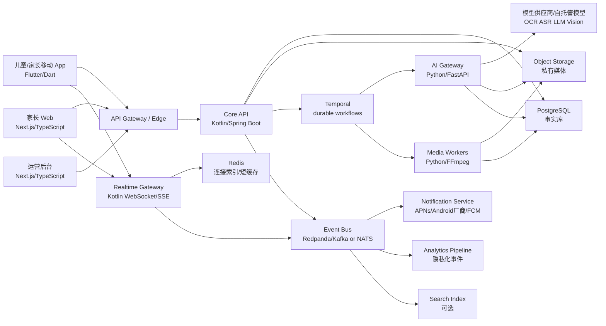

# WishPool 架构设计文档

版本：v1.0  
来源：`WishPool_App_PRD_v2.0_个人家庭版.md`  
日期：2026-08-12

## 1. 文档目标

本文以 WishPool 产品完整实现为目标设计系统架构。设计覆盖：

- 儿童平板端、家长手机端、家长 Web 端、运营管理端的客户端架构。
- 自有业务后端、实时同步、异步工作流、媒体处理、AI 模型处理、推送通知、数据平台和运维平台。
- 长期数据治理、儿童隐私、家庭私密空间、模型审计和跨端一致性。
- 可随产品长期演进的工程边界、语言选择和脚手架。

## 2. 产品边界

WishPool 遵循 PRD 的产品原则：服务家庭内部的儿童成长陪伴，不转向公共社区、陌生人社交、排行榜、广告商城或学校平台。但在家庭私密场景内，产品需要完整覆盖：

- 多角色：儿童、家长、家庭管理员、受邀家庭成员、运营/客服管理员。
- 多端：儿童平板和手机、家长手机、家长 Web、运营后台。
- 多媒体：照片、音频、短视频、衍生缩略图、波形、转写文本、AI 摘要。
- 多周期：每日任务、周心愿、月度回顾、年度成长纪念册。
- 多反馈：近实时审核、语音/文字/表情、补做、退回重提、奖励账本。
- 多模型：OCR、ASR、朗读比对、作业辅助检查、内容安全、纪念册摘要生成。
- 多治理：隐私删除、权限审计、数据导出、模型结果可追踪、成本与质量监控。

## 3. 技术结论

| 层 | 技术选择 | 语言 | 基础脚手架 | 结论 |
| --- | --- | --- | --- | --- |
| 儿童/家长移动端 | Flutter App，单 App 多角色、多布局 | Dart | `flutter create` + Melos 多包工作区 | 适合儿童视觉体验、平板/手机一致交付、音视频能力和长期跨端维护 |
| 家长 Web 端 | Next.js App Router | TypeScript | `create-next-app` + pnpm workspace | 适合配置、回忆检索、纪念册编辑、复杂表单和桌面效率 |
| 运营管理端 | Next.js Admin App | TypeScript | `create-next-app` + RBAC 后台模板 | 和家长 Web 共享组件与 API SDK，但权限完全隔离 |
| 核心业务后端 | 模块化领域服务，优先单核心服务 + 清晰 bounded contexts | Kotlin | Spring Boot + Gradle Kotlin DSL + jOOQ + Flyway | 适合复杂状态机、事务一致性、长期可维护性 |
| 实时同步服务 | Realtime Gateway | Kotlin | Ktor 或 Spring WebFlux | 统一处理 WebSocket/SSE、设备会话、事件扇出 |
| AI 服务 | AI Gateway + AI Workers | Python | FastAPI + Pydantic + uv/Poetry | Python 是模型生态和音视频/ML 处理的最佳选择 |
| 媒体处理 | Media Workers | Python | FastAPI/worker + FFmpeg + Pillow/OpenCV | 处理转码、缩略图、波形、内容安全前处理 |
| 工作流编排 | Durable Workflow | Kotlin + Python workers | Temporal | 适合 AI 预审、周卡生成、删除、重试和长任务 |
| 数据库 | 关系型事实库 | SQL | PostgreSQL + Flyway | 任务、审核、奖励、心愿都需要事务和约束 |
| 对象存储 | S3 兼容私有桶 | - | MinIO 本地 + 云对象存储 | 存原始媒体和衍生媒体，使用签名 URL |
| 缓存/会话 | Redis | - | Redis/Valkey | 会话、限流、实时连接索引、短期缓存 |
| 事件流 | Transactional Outbox + Event Bus | - | PostgreSQL outbox + Redpanda/Kafka 或 NATS JetStream | 跨服务事件、通知、搜索索引、数据分析 |
| 部署 | 容器化平台 | - | Docker + Kubernetes + Helm + Terraform | 支撑 API、WebSocket、worker、AI GPU/CPU 节点和多环境 |
| 可观测性 | 全链路观测 | - | OpenTelemetry + Prometheus/Grafana + Loki/ELK + Sentry | 追踪家庭链路、AI 延迟、审核延迟、客户端崩溃 |

核心判断：

- Firebase 不作为核心后端。它可以作为推送、崩溃分析或远程配置的候选组件，但任务、奖励、心愿、审核和成长数据必须掌握在自有业务后端与自有数据库里。
- TypeScript 不作为核心业务后端语言。TypeScript 适合 Web 和轻 BFF，但 WishPool 的核心事实层需要强事务、强类型领域模型、状态机和长期演进，Kotlin/Spring Boot 更合适。
- Python 不作为核心业务 API 语言，但作为 AI/媒体处理语言是最合适的。
- 架构不是把所有能力一开始拆成很多微服务，而是以清晰领域边界设计。核心业务可由一个模块化服务承载，AI、媒体、实时、工作流、通知作为独立服务或独立部署单元。

## 4. 系统上下文



## 5. 客户端架构

### 5.1 移动与平板 App

移动和平板端选择 Flutter，而不是 React Native、双原生或纯 Web。

原因：

- 儿童端需要高度定制的小屋、心愿动画、卡片动效、音视频采集和稳定的平板体验，Flutter 的渲染一致性和自绘能力更合适。
- 家长端和儿童端共享大量领域模型、同步逻辑、媒体上传逻辑和基础组件，一个移动代码库能减少长期一致性成本。
- 双原生能做到最极致的系统体验，但会把每个产品迭代拆成 iOS/Android 两套 UI 和业务逻辑，长期对家庭协作类产品不划算。
- React Native 对偏运营/内容流类 App 很合适，但 WishPool 的儿童小屋、动画与固定视觉体验更适合 Flutter。

移动 App 架构：

```text
apps/mobile/
├── app/                 # 启动、路由、主题、角色 Shell
├── core/                # 错误、日志、配置、权限、网络、同步引擎
├── design_system/       # 颜色、字体、组件、动效、无障碍规范
├── features/
│   ├── auth/
│   ├── child_room/
│   ├── today_tasks/
│   ├── submission/
│   ├── parent_review/
│   ├── wish/
│   ├── memory/
│   ├── settings/
│   └── notifications/
├── domain/              # 纯 Dart 领域模型、状态机、规则
├── data/                # API client、local DB、repository、DTO mapper
├── platform/            # camera/audio/video/push/native bridge
└── test/
```

关键技术：

- 状态管理：Riverpod + code generation。
- 路由：go_router，按角色和儿童模式锁做 route guard。
- 本地数据库：Drift/SQLite，保存今日任务、草稿、待上传媒体、最近回忆、同步游标。
- 网络：Dio + OpenAPI 生成客户端。
- 实时：WebSocket 优先，SSE 作为 Web 端替代；移动端支持断线重连、事件游标和增量同步。
- 媒体：原生插件 + 平台通道；大文件使用分片/断点续传和后台上传。
- 动效：Rive/Lottie 用于心愿解锁、小屋元素；Flutter 自绘用于拼图、进度和轻交互。
- 崩溃与性能：Sentry/Crashlytics 候选，统一上报 traceId。

### 5.2 家长 Web 端

家长 Web 不用 Flutter Web，选择 Next.js + TypeScript。

Web 更适合：

- 周计划批量配置。
- 成长纪念册编辑和导出。
- 长历史检索。
- 多照片整理。
- 家庭成员和隐私设置。

架构：

```text
apps/parent-web/
├── app/                 # Next.js App Router
├── components/          # Web 组件
├── features/            # planning/review/wish/memory/settings
├── lib/api/             # OpenAPI 生成 SDK
├── lib/auth/
├── lib/query/           # TanStack Query
└── tests/
```

### 5.3 运营管理端

运营后台独立于家长 Web：

- 独立域名、独立 RBAC、独立审计日志。
- 默认不能查看儿童原始媒体；需要受控授权和审计。
- 主要处理账号支持、删除请求、模型质量抽样、推送模板、配置开关、系统健康。

## 6. 服务端架构

### 6.1 服务划分

| 服务 | 语言 | 职责 |
| --- | --- | --- |
| `core-api` | Kotlin/Spring Boot | 认证会话、家庭、任务、提交、审核、奖励、心愿、纪念册、小屋、权限、审计 |
| `realtime-gateway` | Kotlin/Ktor 或 Spring WebFlux | WebSocket/SSE 连接、事件游标、设备会话、家庭事件扇出 |
| `workflow-worker` | Kotlin + Temporal SDK | 业务长流程：任务生成、奖励结算、周卡生成、删除、通知编排 |
| `ai-gateway` | Python/FastAPI | 模型路由、统一输入输出 schema、模型供应商适配、成本/质量记录 |
| `ai-worker` | Python | OCR、ASR、朗读比对、作业辅助检查、内容安全、纪念册摘要 |
| `media-worker` | Python | 图片压缩、缩略图、音频转码、视频转码、波形、元数据抽取 |
| `notification-service` | Kotlin 或 TypeScript | APNs、Android 厂商推送、FCM、站内通知、模板和安静时段 |
| `admin-api` | Kotlin | 运营后台 API、客服审计、系统配置 |

### 6.2 为什么核心后端选 Kotlin/Spring Boot

WishPool 的核心复杂度不是普通 CRUD，而是长期状态和规则：

- 任务实例状态机。
- 提交和重提。
- AI 预审和人工审核的先后关系。
- 星光和心愿碎片的幂等奖励账本。
- 补做、跳过、撤销、核销、归档。
- 成长纪念册自动聚合。
- 家庭权限和儿童隐私。

Kotlin/Spring Boot 的优势：

- Kotlin 比 Java 更简洁，同时保留 JVM 生态、强类型和成熟并发能力。
- Spring Boot/Spring Security/Spring Data/JOOQ/Flyway/Testcontainers 生态成熟。
- 领域模型、事务边界、审计、幂等、后台任务和企业级可观测性更稳。
- 和 PostgreSQL 的关系建模、复杂查询、事务一致性天然匹配。

不选 TypeScript 作为核心后端的原因：

- TypeScript 很适合 Web、BFF 和工具层，但在复杂交易状态、后台工作流、强一致领域模型上，长期维护优势不如 Kotlin/JVM。
- Node 生态可用，但 WishPool 的关键风险在“状态一致性和隐私审计”，不是快速 API 拼装。

不选 Python 作为核心后端的原因：

- Python 是 AI 和媒体处理的最佳语言，但不适合作为全部业务事实层的唯一语言。
- 核心 API 需要高并发、长期可维护、强类型领域约束和复杂事务，Python 更适合放在模型服务边界内。

### 6.3 为什么 AI/媒体选 Python

AI/媒体的复杂度集中在：

- OCR/ASR/Vision/LLM SDK。
- 音频切片、转码、波形、视频抽帧。
- 模型推理、批量任务、GPU/CPU worker。
- Pydantic schema 校验、实验和模型版本。

Python 在这些方面生态最完整。AI 服务通过内部 API 和队列接入，不直接暴露给客户端。

## 7. 数据架构

### 7.1 PostgreSQL 作为事实库

PostgreSQL 是事实源，负责：

- 家庭、成员、儿童资料。
- 任务计划、任务实例、提交、审核。
- 奖励账本、心愿、核销、成长卡。
- 媒体资产元数据、AI 作业、AI 预审结果。
- 通知事件、设备令牌、审计日志、删除请求。

选择关系型数据库的原因：

- 奖励和心愿解锁需要事务一致性。
- 任务、提交、审核、媒体、AI 结果之间有明确关系。
- 家庭权限、审计和删除需要可靠约束。
- 成长纪念册和统计需要聚合查询。

### 7.2 对象存储作为媒体源

对象存储保存：

- 原始照片、原始音频、原始视频。
- 压缩图、缩略图、视频封面、音频波形。
- 纪念册导出文件、PDF、长图。

原则：

- 所有媒体私有存储。
- 客户端通过短时签名 URL 上传/下载。
- 原始媒体和 AI 衍生数据分离。
- 删除家庭数据时必须删除对象存储和数据库记录。

### 7.3 事件与工作流

事件与工作流采用三层机制：

- PostgreSQL Transactional Outbox：保证领域状态写入和事件发布同事务。
- Event Bus：把提交创建、审核完成、奖励发放、心愿解锁等事件分发给通知、实时、数据分析和搜索。
- Temporal：处理需要重试、等待、补偿和可观测的长流程。

不把复杂链路塞进同步 HTTP 请求里。

Core API 提供内部 outbox claim/published/retry API，`workflow-worker` 负责领取事件并启动 Temporal workflow；业务 activity 通过 `X-Internal-Token` 调用 Core API 内部端点执行幂等状态变更。

## 8. 实时同步架构

近实时体验由自有 `realtime-gateway` 提供，而不是数据库客户端直连。

```text
Core API 写入事实库
  -> outbox_event
  -> event bus
  -> realtime-gateway
  -> family/device channel
  -> mobile/web client
```

同步模型：

- 每个家庭有递增 `family_event_seq`。
- 客户端保存同步游标。
- WebSocket 传实时事件。
- 断线后客户端用 `/sync/pull?afterSeq=...` 补事件。
- 儿童设备不可见事件以脱敏占位推进 seq，保证游标连续且不泄露家庭其他数据。
- 推送通知只做后台提醒，不作为事实同步源。

事件类型：

- `task.created`
- `task.updated`
- `submission.created`
- `ai_precheck.completed`
- `review.completed`
- `reward.granted`
- `wish.unlocked`
- `wish.redeemed`
- `memory.generated`
- `room_item.unlocked`
- `family.plan_changed`

## 9. AI 与模型架构

AI 是独立平台能力，但仍遵守 PRD 原则：辅助家长，不替代家长做最终判定。

```text
submission.created
  -> Temporal AIPrecheckWorkflow
  -> media-worker 准备媒体
  -> ai-gateway 选择模型
  -> ai-worker 执行 OCR/ASR/Vision/LLM
  -> 写入 ai_precheck
  -> review_pending
  -> 通知家长
```

AI 平台能力：

- 模型路由：按任务类型、媒体类型、成本、延迟和质量选择供应商或自托管模型。
- 版本控制：prompt、模型、解析器、输出 schema 都带版本。
- 结构化输出：所有 AI 结果必须符合 `AiPrecheckResult` schema。
- 人工优先：家长端只展示“AI 建议”，审核权始终属于家长。
- 质量反馈：家长是否采纳 AI 建议会回流为质量指标。
- 隐私隔离：AI 作业只读取必要媒体和任务文本，生成结果与原始媒体分开授权。

## 10. 媒体处理架构

媒体链路：

```text
客户端申请上传
  -> core-api 返回签名上传 URL
  -> 客户端直传 object storage
  -> core-api finalize media
  -> media-worker 生成衍生文件
  -> AI workflow 读取可分析版本
```

处理内容：

- 图片：压缩、裁剪记录、缩略图、EXIF 清理、OCR 预处理。
- 音频：格式标准化、时长检测、音量归一、波形、ASR 切片。
- 视频：封面、转码、时长限制、抽帧、内容安全预处理。
- 导出：成长卡长图、PDF、年度纪念册文件。

## 11. 安全与隐私架构

### 11.1 认证

认证由自有 Auth/IAM 模块或受控 OIDC 服务承载：

- 家长：手机号、邮箱、Apple、微信等登录方式通过 provider adapter 接入。
- 儿童设备：设备配对 + 设备密钥 + 受限 token，不要求儿童独立注册账号。
- 管理后台：强 MFA、IP/设备风控、细粒度 RBAC。

### 11.2 授权

所有资源访问必须经过：

- `family_id` 隔离。
- `role` 权限。
- `child_id` 范围。
- 操作级 policy。
- 审计日志。

儿童设备只能访问自己的任务、小屋、心愿、反馈和回忆。运营后台默认不能查看原始儿童媒体。

### 11.3 数据保护

- 传输层 TLS。
- 数据库和对象存储加密。
- 媒体签名 URL 短时有效。
- AI 处理最小化输入。
- 删除请求覆盖数据库、对象存储、搜索索引、AI 衍生结果和分析事件。
- 敏感日志脱敏，不记录原始儿童内容。

## 12. 部署与基础设施

部署目标：

- 本地：Docker Compose，包含 PostgreSQL、Redis、对象存储、Temporal、Event Bus。
- 测试/预发/生产：Kubernetes。
- 基础设施：Terraform。
- 应用发布：Helm/Kustomize。
- CI/CD：GitHub Actions。
- 移动发布：Fastlane + App Store Connect / Google Play。

当前开发按自用本地部署落地：`infra/docker-compose` 提供 PostgreSQL、Redis、MinIO 和 Temporal；推送服务保留接口和适配层，具体 APNs/Android 厂商通道在部署配置时接入。

环境：

| 环境 | 用途 |
| --- | --- |
| local | 本地开发、单元测试、集成测试 |
| test | 自动化测试、规则和迁移验证 |
| staging | 真机验收、生产等价配置 |
| production | 正式家庭数据 |

## 13. 可观测性

统一使用 OpenTelemetry trace/span，把一次家庭链路串起来：

```text
孩子提交 -> 媒体上传 -> AI 预审 -> 家长审核 -> 奖励发放 -> 心愿进度 -> 实时通知
```

关键指标：

- API 延迟、错误率、吞吐。
- WebSocket 在线数、重连次数、事件延迟。
- 媒体上传成功率、处理耗时。
- AI 任务排队时长、推理耗时、失败率、成本。
- 家长审核耗时。
- 奖励幂等冲突。
- 数据删除完成率。
- 移动端崩溃率、启动耗时、卡顿。

## 14. 推荐仓库结构

```text
wishpool/
├── apps/
│   ├── mobile/                    # Flutter/Dart，儿童端和家长端移动体验
│   ├── parent-web/                # Next.js/TypeScript，家长 Web
│   └── admin-web/                 # Next.js/TypeScript，运营后台
├── services/
│   ├── core-api/                  # Kotlin/Spring Boot，核心业务 API
│   ├── realtime-gateway/          # Kotlin/Ktor，WebSocket/SSE
│   ├── workflow-worker/           # Kotlin/Temporal，业务工作流
│   ├── notification-service/      # Kotlin，推送和站内通知
│   ├── ai-gateway/                # Python/FastAPI，模型网关
│   ├── ai-worker/                 # Python，模型任务
│   └── media-worker/              # Python/FFmpeg，媒体处理
├── packages/
│   ├── api-contracts/             # OpenAPI/AsyncAPI/JSON Schema/Proto
│   ├── shared-types/              # 生成给 Web/移动端的类型
│   └── design-tokens/             # 跨端设计变量
├── db/
│   ├── migrations/                # Flyway SQL migrations
│   └── seeds/
├── infra/
│   ├── docker-compose/
│   ├── terraform/
│   ├── helm/
│   └── observability/
├── docs/
└── PROJECT_CODE_STRUCTURE.md
```

## 15. 技术决策记录

| 决策 | 结论 | 取舍 |
| --- | --- | --- |
| 移动端 | Flutter/Dart | 牺牲少量平台原生极致，换取儿童视觉一致性和跨端长期效率 |
| 家长/后台 Web | Next.js/TypeScript | Web 表单、编辑、后台效率高，不用 Flutter Web 承担复杂管理界面 |
| 核心后端 | Kotlin/Spring Boot | 适合长期领域模型、事务、权限和审计 |
| AI/媒体 | Python/FastAPI + workers | 模型和媒体生态最佳，不承担核心业务事实 |
| 数据库 | PostgreSQL | 任务/奖励/审核/心愿需要关系约束和事务 |
| 实时 | 自有 Realtime Gateway | 避免数据库直连客户端，支持游标、权限、断线恢复 |
| 工作流 | Temporal | 长任务、重试、补偿、可观测性强 |
| 对象存储 | S3 compatible | 云厂商可替换，媒体私有化和生命周期管理成熟 |
| 部署 | Kubernetes + Terraform | 完整产品需要多服务、worker、GPU/CPU 资源和环境一致性 |

## 16. 官方参考

- [Flutter architectural overview](https://docs.flutter.dev/resources/architectural-overview)
- [Next.js docs](https://nextjs.org/docs)
- [Spring Boot reference](https://docs.spring.io/spring-boot/reference/index.html)
- [FastAPI docs](https://fastapi.tiangolo.com/)
- [PostgreSQL docs](https://www.postgresql.org/docs/current/)
- [Temporal docs](https://docs.temporal.io/)
- [Kubernetes docs](https://kubernetes.io/docs/home/)
- [OpenTelemetry docs](https://opentelemetry.io/docs/)
