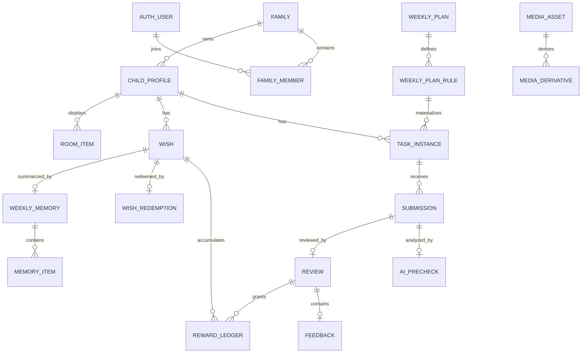
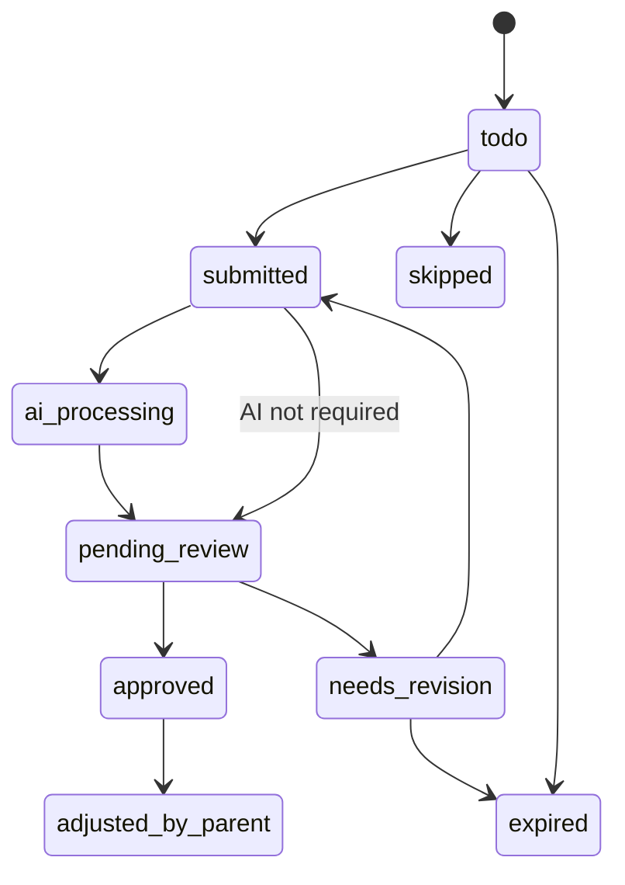
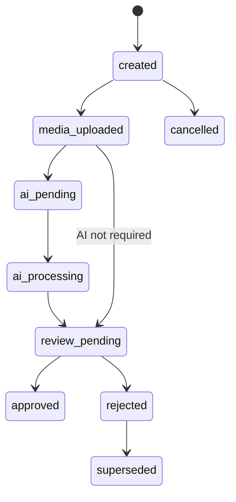
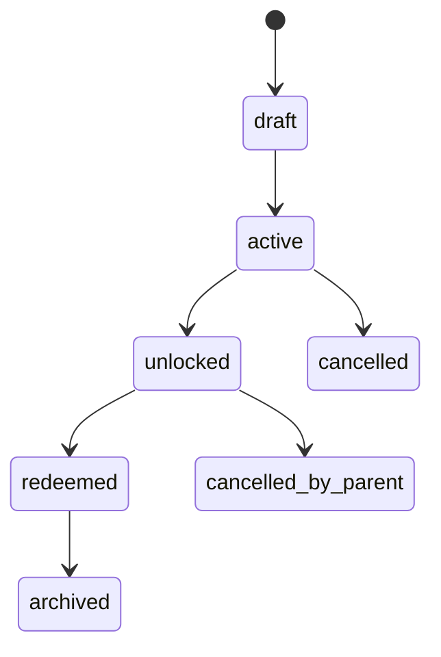

# WishPool 详细设计文档

版本：v1.1  
来源：`WishPool_App_PRD_v2.0_个人家庭版.md`  
日期：2026-08-12

## 1. 文档目标

本文把 WishPool 的产品设计拆成可直接进入工程实现的详细设计，覆盖：

- 功能模块边界、核心用例、命令、查询、领域规则和事件。
- 客户端页面、本地数据、同步策略、上传与实时反馈。
- PostgreSQL 数据模型、字段、枚举、约束、索引和关系。
- REST API、WebSocket 事件、后台工作流、AI/媒体处理、通知、权限和测试。

架构、语言和脚手架的总体结论见 `ARCHITECTURE_DESIGN.md` 和 `TECH_STACK_DECISION.md`。本文不再讨论是否做某个临时版本，而是描述产品需要的完整实现。

已确认的开发输入：

- 部署形态：自用本地部署。
- 登录方式：手机号验证码为主，微信登录作为备选 provider。
- 推送通道：属于部署配置，不阻塞核心业务开发。
- 视觉方向：见 `VISUAL_DESIGN_DIRECTION.md`。
- 开发前置：OpenAPI 契约与 Flyway SQL migrations 先行。

## 2. 核心对象关系



## 3. 角色与权限

| 角色 | 说明 | 主要能力 |
| --- | --- | --- |
| `parent_owner` | 家庭创建者和最高权限家长 | 管理家庭、儿童资料、成员、任务、心愿、审核、隐私删除 |
| `parent` | 受邀家长或家庭成员 | 配置任务、审核反馈、查看纪念册、核销心愿 |
| `child_device` | 绑定某个儿童的受限设备身份 | 查看自己的小屋/任务/心愿/回忆，提交任务，接收反馈 |
| `admin_support` | 运营支持人员 | 查看元数据、处理工单、查看系统状态，不默认访问原始媒体 |
| `admin_super` | 系统管理员 | 配置系统、审计受控访问、处理异常数据 |

权限原则：

- 所有家庭数据以 `family_id` 隔离。
- 所有儿童侧数据再以 `child_id` 缩小范围。
- 儿童设备不能访问家长配置页，不能写审核、奖励、心愿核销和隐私删除。
- 家长可以查看家庭内儿童数据，但敏感操作写审计日志。
- 运营后台默认只看元数据；查看原始媒体需要工单、理由、授权和审计。

## 4. 功能模块设计

### 4.1 Identity 身份与会话

职责：

- 家长账号登录、刷新 token、退出登录。
- 第三方登录 provider 绑定。
- 设备注册、推送 token 绑定、会话撤销。
- 管理后台 MFA 和管理员权限。

核心命令：

| 命令 | 输入 | 输出 | 规则 |
| --- | --- | --- | --- |
| `LoginParentCommand` | provider token / phone code | access token, refresh token | 登录成功后创建或更新 `auth_user` |
| `RefreshSessionCommand` | refresh token | new token pair | refresh token 必须未过期且未撤销 |
| `LogoutCommand` | session id | success | 撤销当前 session |
| `RegisterDeviceCommand` | platform, device name, push token | device id | 同一设备可更新 push token |
| `RevokeDeviceCommand` | device id | success | 撤销设备相关 session |

主要查询：

- 当前登录用户：`GET /me`
- 当前设备：`GET /devices/current`
- 用户会话列表：`GET /sessions`

领域事件：

- `identity.user_logged_in`
- `identity.device_registered`
- `identity.session_revoked`

### 4.2 Family 家庭与成员

职责：

- 创建家庭。
- 管理家庭成员、角色、显示名称。
- 邀请家长。
- 儿童设备配对。

核心命令：

| 命令 | 规则 |
| --- | --- |
| `CreateFamilyCommand` | 创建 `family`、`family_member(parent_owner)`，可同时创建第一个儿童资料 |
| `InviteParentCommand` | 只有 `parent_owner` 可邀请，邀请有过期时间 |
| `AcceptFamilyInviteCommand` | 接受邀请后创建 `family_member(parent)` |
| `CreatePairingSessionCommand` | 家长为某个 `child_id` 创建一次性配对码，只保存 hash |
| `ConsumePairingCodeCommand` | 儿童设备提交配对码，成功后创建 `child_device` 成员和设备会话 |
| `RemoveFamilyMemberCommand` | 不能移除最后一个 `parent_owner` |

查询：

- 家庭详情：`GET /families/{familyId}`
- 家庭成员：`GET /families/{familyId}/members`
- 配对状态：`GET /pairing-sessions/{sessionId}`

事件：

- `family.created`
- `family.member_invited`
- `family.member_joined`
- `family.child_device_paired`
- `family.member_removed`

### 4.3 Child 儿童资料

职责：

- 儿童昵称、头像、出生年份、小屋主题。
- 儿童模式锁配置。
- 多儿童家庭的数据范围。

核心命令：

| 命令 | 规则 |
| --- | --- |
| `CreateChildProfileCommand` | 同一家庭可有多个儿童，昵称不强制唯一 |
| `UpdateChildProfileCommand` | 仅家长可改，儿童设备不可改 |
| `SetChildModeLockCommand` | 设置 PIN 或家长验证方式，防止儿童进入家长模式 |
| `ArchiveChildProfileCommand` | 归档儿童资料不删除历史成长数据 |

查询：

- 儿童列表：`GET /families/{familyId}/children`
- 儿童首页上下文：`GET /children/{childId}/home-context`

事件：

- `child.created`
- `child.updated`
- `child.archived`

### 4.4 Planning 任务模板与周计划

职责：

- 常用任务模板。
- 周计划规则。
- 将计划规则物化为每日任务实例。
- 临时调整当天任务。

核心对象：

- `task_template`：可复用模板。
- `weekly_plan`：某儿童某周计划。
- `weekly_plan_rule`：固定日期和任务配置。
- `task_instance`：某天实际任务。

核心命令：

| 命令 | 规则 |
| --- | --- |
| `CreateTaskTemplateCommand` | 任务类型必须匹配提交类型，如朗读默认音频 |
| `ArchiveTaskTemplateCommand` | 归档模板不影响历史任务实例 |
| `SaveWeeklyPlanCommand` | 同一 `family_id + child_id + week_id` 只有一个计划 |
| `MaterializeWeeklyPlanCommand` | 生成每日 `task_instance`，保留模板快照 |
| `AddAdhocTaskCommand` | 添加当天或未来日期临时任务 |
| `SkipTaskCommand` | 家长可标记任务无需完成，触发奖励重算 |
| `PostponeTaskCommand` | 延后任务生成新日期实例或修改 scheduled_date |

计划规则字段：

- `weekdays`: ISO weekday 数组，1=周一，7=周日。
- `is_core`: 是否计入当天心愿碎片。
- `require_review`: 是否必须家长审核。
- `submission_type`: `photo`、`audio`、`video`、`manual`。

查询：

- 任务模板列表：`GET /task-templates`
- 周计划详情：`GET /plans/{weekId}?childId=...`
- 今日任务：`GET /children/{childId}/today`
- 家长今日概览：`GET /parent/today?date=...`

事件：

- `planning.template_created`
- `planning.weekly_plan_saved`
- `task.created`
- `task.updated`
- `task.skipped`
- `task.postponed`

### 4.5 Submission 多媒体提交

职责：

- 儿童拍照、录音、录像提交。
- 媒体上传会话。
- 重提与尝试次数。
- 客户端幂等。

核心命令：

| 命令 | 规则 |
| --- | --- |
| `CreateUploadSessionCommand` | 服务端校验任务归属和媒体用途，返回签名上传 URL |
| `FinalizeMediaCommand` | 校验对象已上传、大小和 content type 合法 |
| `CreateSubmissionCommand` | `client_mutation_id` 保证重复点击不重复提交 |
| `ResubmitTaskCommand` | 仅 `needs_revision` 或允许重提状态可重提，旧提交标记 `superseded` |
| `CancelDraftSubmissionCommand` | 只取消未 finalize 的本地草稿或服务端待上传媒体 |

提交类型：

- `photo`: 作业照片、整理成果。
- `audio`: 朗读、古诗、英语。
- `video`: 运动、家务、行为记录。
- `manual`: 家长手动确认类任务。

查询：

- 提交详情：`GET /submissions/{submissionId}`
- 某任务提交历史：`GET /tasks/{taskId}/submissions`
- 上传状态：`GET /media/{mediaId}`

事件：

- `submission.created`
- `submission.media_uploaded`
- `submission.superseded`

### 4.6 AI Precheck AI 辅助预审

职责：

- 对提交内容生成家长可快速阅读的 AI 建议。
- 管理 AI job、模型路线、模型调用日志、结果 schema。
- AI 失败不阻塞人工审核。

核心命令/工作流：

| 命令/工作流 | 规则 |
| --- | --- |
| `StartAiPrecheckWorkflow` | 由 `submission.created` 触发 |
| `PrepareMediaForAiActivity` | 媒体标准化、抽帧、切片、缩略图 |
| `RunAiPrecheckActivity` | AI Gateway 选择模型路线并调用 worker |
| `PersistAiPrecheckCommand` | 写入 `ai_precheck`，更新 submission/task 状态 |
| `MarkAiFailedCommand` | AI 失败后进入 `review_pending`，家长端展示不可用提示 |

AI 结果原则：

- 只显示为“AI 建议/AI 预审”。
- 不自动通过任务。
- 不直接发放奖励。
- 输出必须结构化，必须带模型版本和置信度。

事件：

- `ai_precheck.started`
- `ai_precheck.completed`
- `ai_precheck.failed`

### 4.7 Review 家长审核与反馈

职责：

- 家长查看待审核提交。
- 展示原始媒体、AI 摘要、疑似问题。
- 通过或退回。
- 留文字、语音、表情反馈。

核心命令：

| 命令 | 规则 |
| --- | --- |
| `ApproveSubmissionCommand` | submission 必须处于 `review_pending`，事务更新 submission/task/review |
| `RequestRevisionCommand` | 写退回原因和反馈，task 进入 `needs_revision` |
| `CreateFeedbackAudioCommand` | 反馈语音默认 10 秒以内，可配置上限 |
| `EditFeedbackCommand` | 可短时间内编辑，编辑写 audit |
| `RevokeReviewCommand` | 撤销审核不删除历史，用 adjustment 事件修正奖励 |

查询：

- 待审核列表：`GET /reviews/pending`
- 审核详情：`GET /reviews/{submissionId}/detail`
- 反馈详情：`GET /reviews/{reviewId}/feedback`

事件：

- `review.approved`
- `review.revision_requested`
- `feedback.created`
- `review.revoked`

### 4.8 Reward 奖励

职责：

- 星光。
- 心愿碎片。
- 奖励账本。
- 奖励修正。
- 连续完成里程碑。

规则：

- 奖励只通过 `reward_ledger` 写入。
- 客户端不能直接修改奖励数值。
- 所有奖励写 `idempotency_key`。
- 修正使用负向账本或 adjustment 记录，不物理删除历史。

核心命令/工作流：

| 命令/工作流 | 规则 |
| --- | --- |
| `GrantStarLightCommand` | 任务通过、家长表扬、里程碑触发 |
| `EvaluateDailyWishFragmentWorkflow` | 聚合当天核心任务，决定是否发 1 块碎片 |
| `GrantWishFragmentCommand` | 同一 child/date/week 只能发一次 |
| `AdjustRewardCommand` | 撤销审核或家长修正时写负向账本 |
| `EvaluateMilestoneWorkflow` | 连续阅读、月度心愿等里程碑 |

事件：

- `reward.star_light_granted`
- `reward.wish_fragment_granted`
- `reward.adjusted`
- `reward.milestone_unlocked`

### 4.9 Wish 心愿

职责：

- 心愿创建、编辑、激活。
- 拼图进度。
- 心愿解锁。
- 心愿核销。

核心命令：

| 命令 | 规则 |
| --- | --- |
| `CreateWishCommand` | 心愿必须归属 child/week，可带图片和备注 |
| `ActivateWishCommand` | 同一 child/week 只有一个 active wish |
| `UpdateWishCommand` | 已 redeemed 的心愿不可改核心字段 |
| `UnlockWishCommand` | 由奖励工作流触发，earned >= required |
| `RedeemWishCommand` | 家长上传 1-3 张照片和一句话 |
| `CancelWishCommand` | 取消写原因，不删除历史 |

查询：

- 当前心愿：`GET /children/{childId}/wishes/current`
- 心愿历史：`GET /children/{childId}/wishes`
- 心愿详情：`GET /wishes/{wishId}`

事件：

- `wish.created`
- `wish.activated`
- `wish.unlocked`
- `wish.redeemed`
- `wish.cancelled`

### 4.10 Memory 成长纪念册

职责：

- 周成长卡。
- 月度回顾。
- 年度纪念册。
- 照片、声音、父母留言沉淀。
- 导出长图/PDF。

核心命令/工作流：

| 命令/工作流 | 规则 |
| --- | --- |
| `GenerateWeeklyMemoryWorkflow` | 心愿核销或周结束后聚合生成 |
| `UpdateMemorySelectionCommand` | 家长精选照片、音频、留言 |
| `GenerateMonthlyMemoryWorkflow` | 聚合月度心愿和里程碑 |
| `GenerateYearlyMemoryWorkflow` | 聚合年度回忆，可调用 AI 生成文案草稿 |
| `ExportMemoryCommand` | 导出 PDF/长图，生成 media asset |

查询：

- 时间轴：`GET /memories?childId=...`
- 周卡详情：`GET /memories/weekly/{weekId}`
- 月度回顾：`GET /memories/monthly/{month}`
- 导出状态：`GET /memory-exports/{exportId}`

事件：

- `memory.weekly_generated`
- `memory.selection_updated`
- `memory.export_requested`
- `memory.export_completed`

### 4.11 Room 小屋

职责：

- 小屋首页展示。
- 照片墙、书架、徽章、纪念角。
- 真实行为驱动展示元素。
- 小屋与纪念册联动。

核心命令/工作流：

| 命令/工作流 | 规则 |
| --- | --- |
| `UnlockRoomItemCommand` | 来源必须是真实行为或家长精选 |
| `SelectMemoryForRoomCommand` | 家长从纪念册精选进入小屋 |
| `ArrangeRoomItemCommand` | 可调整位置，但不做自由商城装修 |
| `HideRoomItemCommand` | 隐藏不删除历史来源 |
| `EvaluateRoomMilestoneWorkflow` | 阅读 7 天、月度心愿等触发 |

查询：

- 小屋状态：`GET /room/state?childId=...`
- 小屋元素：`GET /room/items?childId=...`

事件：

- `room.item_unlocked`
- `room.item_selected`
- `room.item_arranged`
- `room.item_hidden`

### 4.12 Notification 通知

职责：

- 站内通知。
- 系统推送。
- 安静时段。
- 通知合并与去重。
- 国内 Android 厂商通道、APNs、FCM adapter。

核心命令/工作流：

| 命令/工作流 | 规则 |
| --- | --- |
| `RegisterPushTokenCommand` | 绑定 device 和平台 token |
| `UpdateNotificationPreferenceCommand` | 家长可配置类型和安静时段 |
| `CreateNotificationEventCommand` | 写站内通知事件 |
| `DispatchPushNotificationActivity` | 按平台选择推送通道 |
| `DeduplicateNotificationCommand` | 同任务的提交和 AI 完成提醒可合并 |

事件：

- `notification.created`
- `notification.sent`
- `notification.failed`
- `notification.read`

### 4.13 Privacy 隐私与数据治理

职责：

- 数据导出。
- 家庭数据删除。
- AI 原始文本保留周期。
- 运营访问审计。
- 媒体生命周期。

核心命令/工作流：

| 命令/工作流 | 规则 |
| --- | --- |
| `RequestDataExportCommand` | 只有家长可发起，导出包私有存储 |
| `RequestFamilyDeletionCommand` | 需要二次验证，进入删除工作流 |
| `RunFamilyDeletionWorkflow` | 删除数据库、对象存储、搜索索引、AI 衍生数据 |
| `SetRetentionPolicyCommand` | 管理员配置保留周期 |
| `GrantAdminMediaAccessCommand` | 工单授权，短时有效，必须审计 |

事件：

- `privacy.export_requested`
- `privacy.export_completed`
- `privacy.deletion_requested`
- `privacy.deletion_completed`
- `privacy.admin_media_access_granted`

## 5. 客户端页面与本地模型

### 5.1 移动 App 分层

```text
presentation -> application -> domain -> data -> infrastructure
```

| 层 | 内容 |
| --- | --- |
| `presentation` | Flutter 页面、组件、动画、响应式布局 |
| `application` | 页面用例、上传编排、同步编排、权限判断 |
| `domain` | 纯 Dart 实体、值对象、状态机和规则 |
| `data` | Repository、DTO mapper、OpenAPI client、本地缓存 |
| `infrastructure` | HTTP、WebSocket、SQLite、相机、录音、推送、对象存储上传 |

### 5.2 儿童端页面

| 页面 | 路由 | 主要数据 | 关键操作 |
| --- | --- | --- | --- |
| 儿童配对 | `/child/pair` | pairing session | 输入配对码、扫码 |
| 小屋首页 | `/child/room` | room state, current wish, latest feedback | 开始今天任务、查看反馈 |
| 今日任务 | `/child/today` | today tasks, daily summary, wish progress | 进入任务、查看进度 |
| 任务详情 | `/child/tasks/:taskId` | task detail, latest submission | 选择提交方式 |
| 图片提交 | `/child/tasks/:taskId/photo` | upload session | 拍照、裁剪、提交 |
| 朗读录音 | `/child/tasks/:taskId/audio` | target text, upload session | 录音、试听、提交 |
| 视频提交 | `/child/tasks/:taskId/video` | upload session | 录制、压缩、提交 |
| 提交状态 | `/child/submissions/:submissionId` | submission, ai status, review status | 等待反馈、重新提交 |
| 心愿主页 | `/child/wish` | active wish, fragments | 查看拼图、解锁动画 |
| 回忆时间轴 | `/child/memories` | weekly/monthly memories | 浏览回忆 |
| 周成长卡 | `/child/memories/:weekId` | weekly memory detail | 播放声音、看照片 |

### 5.3 家长移动端页面

| 页面 | 路由 | 主要数据 | 关键操作 |
| --- | --- | --- | --- |
| 家长首页 | `/parent/home` | children summary, pending count, active wish | 快速进入审核 |
| 今日状态 | `/parent/today` | daily tasks, daily summary | 跳过、延后、添加任务 |
| 待审核 | `/parent/reviews` | review queue | 快速通过、进入详情 |
| 审核详情 | `/parent/reviews/:submissionId` | media, ai precheck, task | 通过、退回、反馈 |
| 周计划 | `/parent/plans/:weekId` | templates, rules | 批量配置任务 |
| 心愿 | `/parent/wish` | active wish, progress | 创建、编辑、核销 |
| 纪念册 | `/parent/memories` | timeline | 精选、导出 |
| 家庭设置 | `/parent/settings/family` | members, children, devices | 邀请、移除、配对 |
| 隐私设置 | `/parent/settings/privacy` | export/delete state | 导出、删除请求 |

### 5.4 家长 Web 与运营后台

家长 Web 重点承载高密度操作：

- 周计划批量编辑。
- 任务模板管理。
- 长历史检索。
- 成长纪念册整理和导出。
- 家庭成员、设备和隐私设置。

运营后台重点承载受控支持：

- 工单。
- 删除请求。
- 推送模板。
- AI 任务质量和成本监控。
- 审计日志。
- 系统配置。

### 5.5 移动端本地表

| 表 | 用途 |
| --- | --- |
| `local_account` | 当前用户、家庭、角色 |
| `local_child_context` | 当前儿童资料和小屋主题 |
| `local_task_instance` | 今日任务和最近任务缓存 |
| `local_submission_draft` | 未完成提交草稿 |
| `local_upload_queue` | 媒体上传任务、进度、重试次数 |
| `local_wish` | 当前心愿和碎片进度 |
| `local_feedback` | 最近反馈弹窗内容 |
| `local_room_item` | 小屋元素缓存 |
| `local_memory_summary` | 回忆时间轴缓存 |
| `local_sync_cursor` | 每个 family 的 `last_seq` |
| `local_event_log` | 最近同步事件，用于断线恢复和排查 |

## 6. PostgreSQL 数据模型

### 6.1 通用字段规范

除关联表和特殊表外，业务表默认包含：

| 字段 | 类型 | 说明 |
| --- | --- | --- |
| `id` | `uuid` | 主键，服务端生成 |
| `created_at` | `timestamptz` | 创建时间 |
| `updated_at` | `timestamptz` | 更新时间 |
| `deleted_at` | `timestamptz null` | 软删除时间，隐私删除会物理清理或匿名化 |
| `version` | `bigint` | 乐观锁版本 |

命名规范：

- 外键统一为 `{entity}_id`。
- JSON 字段统一后缀 `_json`。
- 状态字段统一为 `status`，枚举使用小写 snake_case。
- 所有家庭业务表必须包含 `family_id`。
- 所有儿童相关表必须包含 `child_id`。

### 6.2 枚举

```text
user_status = active | suspended | deleted
family_status = active | locked | deleting | deleted
member_role = parent_owner | parent | child_device
member_status = active | invited | suspended | removed
admin_role = admin_support | admin_super
child_status = active | archived
device_platform = ios | android | ipad_os | web | admin_web
session_status = active | revoked | expired
invite_status = pending | accepted | expired | revoked
pairing_status = active | consumed | expired | revoked
task_category = study | reading | exercise | habit | custom
submission_type = photo | audio | video | manual
weekly_plan_status = draft | active | archived
task_status = todo | submitted | ai_processing | pending_review | approved | needs_revision | skipped | expired | adjusted_by_parent
submission_status = created | media_uploaded | ai_pending | ai_processing | review_pending | approved | rejected | superseded | cancelled
review_decision = approved | needs_revision
reward_type = star_light | wish_fragment | adjustment
wish_status = draft | active | unlocked | redeemed | archived | cancelled | cancelled_by_parent
ai_job_status = queued | media_preparing | running | succeeded | failed_retryable | failed_final | cancelled
media_status = upload_pending | uploaded | processing | ready | failed | deleted
notification_status = pending | sent | failed | read | suppressed
privacy_request_status = requested | verifying | locking_family | deleting_records | deleting_objects | verifying_deletion | completed | failed_needs_attention
```

### 6.3 身份与家庭表

#### `auth_user`

| 字段 | 类型 | 约束 | 说明 |
| --- | --- | --- | --- |
| `id` | `uuid` | PK | 用户 ID |
| `status` | `text` | not null | `active/suspended/deleted` |
| `display_name` | `text` | not null | 显示名 |
| `avatar_url` | `text` | nullable | 头像 |
| `last_login_at` | `timestamptz` | nullable | 最近登录 |
| `created_at` | `timestamptz` | not null | 创建时间 |
| `updated_at` | `timestamptz` | not null | 更新时间 |

索引：

- `idx_auth_user_status(status)`

#### `auth_provider_identity`

| 字段 | 类型 | 约束 | 说明 |
| --- | --- | --- | --- |
| `id` | `uuid` | PK | 绑定 ID |
| `user_id` | `uuid` | FK auth_user | 用户 |
| `provider` | `text` | not null | `phone/email/apple/wechat/google` |
| `provider_subject` | `text` | not null | provider 用户唯一标识 |
| `verified_at` | `timestamptz` | nullable | 验证时间 |
| `created_at` | `timestamptz` | not null | 创建时间 |

约束：

- `unique(provider, provider_subject)`
- `unique(user_id, provider)`

#### `auth_session`

| 字段 | 类型 | 约束 | 说明 |
| --- | --- | --- | --- |
| `id` | `uuid` | PK | 会话 ID |
| `user_id` | `uuid` | FK auth_user | 用户 |
| `device_id` | `uuid` | FK device nullable | 设备 |
| `refresh_token_hash` | `text` | not null unique | refresh token hash |
| `status` | `text` | not null | active/revoked/expired |
| `issued_at` | `timestamptz` | not null | 签发时间 |
| `expires_at` | `timestamptz` | not null | 过期时间 |
| `revoked_at` | `timestamptz` | nullable | 撤销时间 |
| `created_at` | `timestamptz` | not null | 创建时间 |

索引：

- `idx_auth_session_user_status(user_id, status)`
- `idx_auth_session_expires(expires_at)`

#### `admin_user_role`

| 字段 | 类型 | 约束 | 说明 |
| --- | --- | --- | --- |
| `user_id` | `uuid` | FK auth_user | 管理员用户 |
| `role` | `text` | not null | admin_support/admin_super |
| `granted_by` | `uuid` | FK auth_user | 授权人 |
| `granted_at` | `timestamptz` | not null | 授权时间 |
| `revoked_at` | `timestamptz` | nullable | 撤销时间 |

主键：

- `primary key(user_id, role)`

#### `family`

| 字段 | 类型 | 约束 | 说明 |
| --- | --- | --- | --- |
| `id` | `uuid` | PK | 家庭 ID |
| `name` | `text` | not null | 家庭名称 |
| `timezone` | `text` | not null | IANA timezone，如 `Asia/Shanghai` |
| `owner_user_id` | `uuid` | FK auth_user | 创建者 |
| `status` | `text` | not null | `active/locked/deleting/deleted` |
| `created_at` | `timestamptz` | not null | 创建时间 |
| `updated_at` | `timestamptz` | not null | 更新时间 |

索引：

- `idx_family_owner(owner_user_id)`
- `idx_family_status(status)`

#### `family_member`

| 字段 | 类型 | 约束 | 说明 |
| --- | --- | --- | --- |
| `id` | `uuid` | PK | 成员 ID |
| `family_id` | `uuid` | FK family | 家庭 |
| `user_id` | `uuid` | FK auth_user | 用户或儿童设备虚拟用户 |
| `role` | `text` | not null | 角色 |
| `child_id` | `uuid` | FK child_profile nullable | 儿童设备绑定的 child |
| `display_name` | `text` | not null | 家庭内显示名 |
| `status` | `text` | not null | 成员状态 |
| `created_at` | `timestamptz` | not null | 创建时间 |
| `updated_at` | `timestamptz` | not null | 更新时间 |

约束：

- `unique(family_id, user_id)` where `status != 'removed'`
- `child_id is not null` when `role = 'child_device'`
- `child_id is null` when `role in ('parent_owner','parent')`

索引：

- `idx_family_member_family_role(family_id, role)`
- `idx_family_member_user(user_id)`
- `idx_family_member_child(child_id)`

#### `family_invite`

| 字段 | 类型 | 约束 | 说明 |
| --- | --- | --- | --- |
| `id` | `uuid` | PK | 邀请 ID |
| `family_id` | `uuid` | FK family | 家庭 |
| `invited_by` | `uuid` | FK auth_user | 邀请人 |
| `invitee_contact_hash` | `text` | nullable | 被邀请手机号/邮箱 hash |
| `role` | `text` | not null | parent |
| `token_hash` | `text` | not null unique | 邀请 token hash |
| `status` | `text` | not null | pending/accepted/expired/revoked |
| `expires_at` | `timestamptz` | not null | 过期时间 |
| `accepted_by` | `uuid` | FK auth_user nullable | 接受人 |
| `accepted_at` | `timestamptz` | nullable | 接受时间 |
| `created_at` | `timestamptz` | not null | 创建时间 |

索引：

- `idx_family_invite_family_status(family_id, status)`

#### `child_profile`

| 字段 | 类型 | 约束 | 说明 |
| --- | --- | --- | --- |
| `id` | `uuid` | PK | 儿童 ID |
| `family_id` | `uuid` | FK family | 家庭 |
| `nickname` | `text` | not null | 昵称 |
| `birth_year` | `int` | nullable | 出生年份 |
| `avatar_asset` | `text` | nullable | 内置头像资源 |
| `room_theme` | `text` | not null | 小屋主题 |
| `mode_lock_hash` | `text` | nullable | 儿童模式锁 hash |
| `status` | `text` | not null | active/archived |
| `created_at` | `timestamptz` | not null | 创建时间 |
| `updated_at` | `timestamptz` | not null | 更新时间 |

索引：

- `idx_child_profile_family_status(family_id, status)`

#### `device`

| 字段 | 类型 | 约束 | 说明 |
| --- | --- | --- | --- |
| `id` | `uuid` | PK | 设备 ID |
| `family_id` | `uuid` | FK family nullable | 所属家庭 |
| `user_id` | `uuid` | FK auth_user | 登录用户 |
| `child_id` | `uuid` | FK child_profile nullable | 儿童设备绑定 |
| `platform` | `text` | not null | 平台 |
| `device_name` | `text` | nullable | 设备名 |
| `push_token` | `text` | nullable | 推送 token |
| `push_provider` | `text` | nullable | apns/fcm/huawei/xiaomi/oppo/vivo |
| `last_seen_at` | `timestamptz` | nullable | 最近活跃 |
| `created_at` | `timestamptz` | not null | 创建时间 |
| `updated_at` | `timestamptz` | not null | 更新时间 |

索引：

- `idx_device_user(user_id)`
- `idx_device_family_child(family_id, child_id)`
- `idx_device_push_token(push_provider, push_token)`

#### `pairing_session`

| 字段 | 类型 | 约束 | 说明 |
| --- | --- | --- | --- |
| `id` | `uuid` | PK | 配对会话 ID |
| `family_id` | `uuid` | FK family | 家庭 |
| `child_id` | `uuid` | FK child_profile | 儿童 |
| `created_by` | `uuid` | FK auth_user | 创建家长 |
| `code_hash` | `text` | not null | 一次性配对码 hash |
| `status` | `text` | not null | active/consumed/expired/revoked |
| `expires_at` | `timestamptz` | not null | 过期时间 |
| `consumed_by_user_id` | `uuid` | FK auth_user nullable | 儿童设备虚拟用户 |
| `consumed_device_id` | `uuid` | FK device nullable | 消费设备 |
| `consumed_at` | `timestamptz` | nullable | 消费时间 |
| `created_at` | `timestamptz` | not null | 创建时间 |

索引：

- `idx_pairing_family_child_status(family_id, child_id, status)`
- `idx_pairing_expires(expires_at)`

### 6.4 任务与提交表

#### `task_template`

| 字段 | 类型 | 约束 | 说明 |
| --- | --- | --- | --- |
| `id` | `uuid` | PK | 模板 ID |
| `family_id` | `uuid` | FK family | 家庭 |
| `title` | `text` | not null | 模板名称 |
| `category` | `text` | not null | study/reading/exercise/habit/custom |
| `submission_type` | `text` | not null | photo/audio/video/manual |
| `description` | `text` | nullable | 默认说明 |
| `target_text` | `text` | nullable | 朗读目标文本 |
| `default_duration_sec` | `int` | nullable | 默认时长 |
| `created_by` | `uuid` | FK auth_user | 创建人 |
| `archived_at` | `timestamptz` | nullable | 归档时间 |
| `created_at` | `timestamptz` | not null | 创建时间 |
| `updated_at` | `timestamptz` | not null | 更新时间 |

索引：

- `idx_task_template_family_category(family_id, category)`
- `idx_task_template_active(family_id) where archived_at is null`

#### `weekly_plan`

| 字段 | 类型 | 约束 | 说明 |
| --- | --- | --- | --- |
| `id` | `uuid` | PK | 计划 ID |
| `family_id` | `uuid` | FK family | 家庭 |
| `child_id` | `uuid` | FK child_profile | 儿童 |
| `week_id` | `text` | not null | ISO week，如 `2026-W33` |
| `start_date` | `date` | not null | 周开始 |
| `end_date` | `date` | not null | 周结束 |
| `wish_id` | `uuid` | FK wish nullable | 本周心愿 |
| `reward_mode` | `text` | not null | flexible/strict |
| `status` | `text` | not null | draft/active/archived |
| `version` | `bigint` | not null | 乐观锁 |
| `created_by` | `uuid` | FK auth_user | 创建人 |
| `created_at` | `timestamptz` | not null | 创建时间 |
| `updated_at` | `timestamptz` | not null | 更新时间 |

约束：

- `unique(family_id, child_id, week_id)`
- `start_date <= end_date`

#### `weekly_plan_rule`

| 字段 | 类型 | 约束 | 说明 |
| --- | --- | --- | --- |
| `id` | `uuid` | PK | 规则 ID |
| `weekly_plan_id` | `uuid` | FK weekly_plan | 周计划 |
| `task_template_id` | `uuid` | FK task_template nullable | 来源模板 |
| `title_snapshot` | `text` | not null | 名称快照 |
| `category` | `text` | not null | 类型快照 |
| `submission_type` | `text` | not null | 提交类型快照 |
| `description_snapshot` | `text` | nullable | 说明快照 |
| `target_text_snapshot` | `text` | nullable | 朗读文本快照 |
| `weekdays` | `int[]` | not null | ISO weekday |
| `is_core` | `boolean` | not null | 是否核心任务 |
| `require_review` | `boolean` | not null | 是否需审核 |
| `sort_order` | `int` | not null | 排序 |
| `superseded_at` | `timestamptz` | nullable | 周计划再次保存时旧规则的替换时间 |
| `created_at` | `timestamptz` | not null | 创建时间 |

约束：

- `weekdays <@ array[1,2,3,4,5,6,7]`

#### `task_instance`

| 字段 | 类型 | 约束 | 说明 |
| --- | --- | --- | --- |
| `id` | `uuid` | PK | 任务实例 ID |
| `family_id` | `uuid` | FK family | 家庭 |
| `child_id` | `uuid` | FK child_profile | 儿童 |
| `weekly_plan_id` | `uuid` | FK weekly_plan nullable | 周计划 |
| `plan_rule_id` | `uuid` | FK weekly_plan_rule nullable | 计划规则 |
| `scheduled_date` | `date` | not null | 任务日期 |
| `source` | `text` | not null | weekly_rule/adhoc/carry_over |
| `title` | `text` | not null | 任务名称 |
| `category` | `text` | not null | 任务类型 |
| `submission_type` | `text` | not null | 提交类型 |
| `description` | `text` | nullable | 说明 |
| `target_text` | `text` | nullable | 朗读目标文本 |
| `is_core` | `boolean` | not null | 是否核心 |
| `require_review` | `boolean` | not null | 是否需审核 |
| `status` | `text` | not null | 任务状态 |
| `latest_submission_id` | `uuid` | FK submission nullable | 最新提交 |
| `approved_review_id` | `uuid` | FK review nullable | 通过审核 |
| `skip_reason` | `text` | nullable | 跳过原因 |
| `original_task_instance_id` | `uuid` | FK task_instance nullable | 延后生成的新任务指向原任务 |
| `sort_order` | `int` | not null | 排序 |
| `version` | `bigint` | not null | 乐观锁 |
| `created_at` | `timestamptz` | not null | 创建时间 |
| `updated_at` | `timestamptz` | not null | 更新时间 |

索引：

- `idx_task_child_date(child_id, scheduled_date, sort_order)`
- `idx_task_family_date_status(family_id, scheduled_date, status)`
- `idx_task_review_queue(family_id, status, updated_at desc) where status = 'pending_review'`
- `unique(child_id, scheduled_date, plan_rule_id) where plan_rule_id is not null`

#### `submission`

| 字段 | 类型 | 约束 | 说明 |
| --- | --- | --- | --- |
| `id` | `uuid` | PK | 提交 ID |
| `family_id` | `uuid` | FK family | 家庭 |
| `child_id` | `uuid` | FK child_profile | 儿童 |
| `task_instance_id` | `uuid` | FK task_instance | 任务 |
| `attempt_no` | `int` | not null | 第几次提交 |
| `submission_type` | `text` | not null | 提交类型 |
| `status` | `text` | not null | 提交状态 |
| `client_mutation_id` | `text` | not null | 客户端幂等 ID |
| `submitted_by_device_id` | `uuid` | FK device | 提交设备 |
| `submitted_at` | `timestamptz` | not null | 提交时间 |
| `superseded_by_submission_id` | `uuid` | FK submission nullable | 被哪次提交替代 |
| `created_at` | `timestamptz` | not null | 创建时间 |
| `updated_at` | `timestamptz` | not null | 更新时间 |

约束：

- `unique(family_id, client_mutation_id)`
- `unique(task_instance_id, attempt_no)`

索引：

- `idx_submission_task_attempt(task_instance_id, attempt_no desc)`
- `idx_submission_review_queue(family_id, status, submitted_at desc) where status = 'review_pending'`
- `idx_submission_child_date(child_id, submitted_at desc)`

#### `submission_media`

| 字段 | 类型 | 约束 | 说明 |
| --- | --- | --- | --- |
| `submission_id` | `uuid` | FK submission | 提交 |
| `media_asset_id` | `uuid` | FK media_asset | 媒体 |
| `sort_order` | `int` | not null | 排序 |

主键：

- `primary key(submission_id, media_asset_id)`

#### `review`

| 字段 | 类型 | 约束 | 说明 |
| --- | --- | --- | --- |
| `id` | `uuid` | PK | 审核 ID |
| `family_id` | `uuid` | FK family | 家庭 |
| `child_id` | `uuid` | FK child_profile | 儿童 |
| `submission_id` | `uuid` | FK submission | 提交 |
| `task_instance_id` | `uuid` | FK task_instance | 任务 |
| `decision` | `text` | not null | approved/needs_revision |
| `reviewed_by` | `uuid` | FK auth_user | 审核人 |
| `created_at` | `timestamptz` | not null | 审核时间 |
| `revoked_at` | `timestamptz` | nullable | 撤销时间 |
| `revoke_reason` | `text` | nullable | 撤销原因 |

约束：

- `unique(submission_id) where revoked_at is null`

#### `feedback`

| 字段 | 类型 | 约束 | 说明 |
| --- | --- | --- | --- |
| `id` | `uuid` | PK | 反馈 ID |
| `review_id` | `uuid` | FK review | 审核 |
| `emoji` | `text` | nullable | heart/star/smile 等 |
| `text` | `text` | nullable | 文字反馈 |
| `audio_media_id` | `uuid` | FK media_asset nullable | 语音反馈 |
| `created_at` | `timestamptz` | not null | 创建时间 |
| `updated_at` | `timestamptz` | not null | 更新时间 |

### 6.5 媒体与 AI 表

#### `media_asset`

| 字段 | 类型 | 约束 | 说明 |
| --- | --- | --- | --- |
| `id` | `uuid` | PK | 媒体 ID |
| `family_id` | `uuid` | FK family | 家庭 |
| `child_id` | `uuid` | FK child_profile nullable | 儿童 |
| `purpose` | `text` | not null | submission/feedback/wish_image/wish_redemption/memory_export |
| `storage_key` | `text` | not null unique | 对象存储 key |
| `content_type` | `text` | not null | MIME |
| `size_bytes` | `bigint` | nullable | 文件大小 |
| `related_type` | `text` | nullable | 上传会话预期关联资源类型 |
| `related_id` | `uuid` | nullable | 上传会话预期关联资源 ID |
| `duration_sec` | `int` | nullable | 音视频时长 |
| `width` | `int` | nullable | 图片/视频宽 |
| `height` | `int` | nullable | 图片/视频高 |
| `checksum_sha256` | `text` | nullable | 校验 |
| `status` | `text` | not null | upload_pending/uploaded/processing/ready/failed/deleted |
| `created_by` | `uuid` | FK auth_user | 创建人/设备用户 |
| `created_at` | `timestamptz` | not null | 创建时间 |
| `updated_at` | `timestamptz` | not null | 更新时间 |

索引：

- `idx_media_family_child(family_id, child_id, created_at desc)`
- `idx_media_status(status, created_at)`
- `idx_media_asset_related_resource(family_id, related_type, related_id)`

#### `media_derivative`

| 字段 | 类型 | 约束 | 说明 |
| --- | --- | --- | --- |
| `id` | `uuid` | PK | 衍生文件 ID |
| `media_asset_id` | `uuid` | FK media_asset | 原始媒体 |
| `kind` | `text` | not null | thumbnail/preview/waveform/transcoded/ai_ready |
| `storage_key` | `text` | not null unique | 对象 key |
| `content_type` | `text` | not null | MIME |
| `size_bytes` | `bigint` | nullable | 大小 |
| `metadata_json` | `jsonb` | not null default '{}' | 衍生元数据 |
| `created_at` | `timestamptz` | not null | 创建时间 |

约束：

- `unique(media_asset_id, kind)`

#### `ai_job`

| 字段 | 类型 | 约束 | 说明 |
| --- | --- | --- | --- |
| `id` | `uuid` | PK | AI 作业 |
| `family_id` | `uuid` | FK family | 家庭 |
| `child_id` | `uuid` | FK child_profile | 儿童 |
| `submission_id` | `uuid` | FK submission nullable | 对应提交 |
| `job_type` | `text` | not null | image_homework_precheck/reading_audio_precheck 等 |
| `status` | `text` | not null | 作业状态 |
| `model_route` | `text` | nullable | 模型路线 |
| `attempt_count` | `int` | not null default 0 | 尝试次数 |
| `error_code` | `text` | nullable | 错误码 |
| `error_message` | `text` | nullable | 脱敏错误 |
| `created_at` | `timestamptz` | not null | 创建时间 |
| `updated_at` | `timestamptz` | not null | 更新时间 |

索引：

- `idx_ai_job_status_created(status, created_at)`
- `idx_ai_job_submission(submission_id)`

#### `ai_precheck`

| 字段 | 类型 | 约束 | 说明 |
| --- | --- | --- | --- |
| `id` | `uuid` | PK | 预审 ID |
| `family_id` | `uuid` | FK family | 家庭 |
| `child_id` | `uuid` | FK child_profile | 儿童 |
| `ai_job_id` | `uuid` | FK ai_job | AI 作业 |
| `submission_id` | `uuid` | FK submission | 提交 |
| `type` | `text` | not null | 预审类型 |
| `summary` | `text` | not null | 家长端摘要 |
| `confidence` | `numeric(4,3)` | nullable | 0-1 |
| `flags_json` | `jsonb` | not null default '[]' | 疑似问题 |
| `raw_text_ref` | `text` | nullable | 原始 OCR/ASR 文本引用 |
| `model_provider` | `text` | not null | 模型供应商 |
| `model_name` | `text` | not null | 模型名 |
| `model_version` | `text` | not null | 模型版本 |
| `prompt_version` | `text` | nullable | prompt 版本 |
| `created_at` | `timestamptz` | not null | 创建时间 |

约束：

- `unique(submission_id)`

#### `model_invocation_log`

| 字段 | 类型 | 约束 | 说明 |
| --- | --- | --- | --- |
| `id` | `uuid` | PK | 调用日志 |
| `ai_job_id` | `uuid` | FK ai_job | AI 作业 |
| `provider` | `text` | not null | 供应商 |
| `model` | `text` | not null | 模型 |
| `latency_ms` | `int` | nullable | 延迟 |
| `cost_units` | `numeric(12,4)` | nullable | 成本单位 |
| `status` | `text` | not null | succeeded/failed |
| `error_code` | `text` | nullable | 错误码 |
| `created_at` | `timestamptz` | not null | 创建时间 |

### 6.6 奖励、心愿、回忆、小屋表

#### `daily_summary`

| 字段 | 类型 | 约束 | 说明 |
| --- | --- | --- | --- |
| `family_id` | `uuid` | FK family | 家庭 |
| `child_id` | `uuid` | FK child_profile | 儿童 |
| `date` | `date` | not null | 日期 |
| `week_id` | `text` | not null | ISO week |
| `core_required` | `int` | not null | 核心任务数 |
| `core_approved` | `int` | not null | 已通过核心任务 |
| `core_skipped` | `int` | not null | 已跳过核心任务 |
| `total_tasks` | `int` | not null | 总任务数 |
| `approved_tasks` | `int` | not null | 已通过任务数 |
| `fragment_status` | `text` | not null | not_eligible/not_earned/earned/makeup_available/makeup_earned/adjusted |
| `fragment_reward_id` | `uuid` | FK reward_ledger nullable | 碎片奖励 |
| `updated_at` | `timestamptz` | not null | 更新时间 |

主键：

- `primary key(family_id, child_id, date)`

#### `reward_ledger`

| 字段 | 类型 | 约束 | 说明 |
| --- | --- | --- | --- |
| `id` | `uuid` | PK | 奖励记录 |
| `family_id` | `uuid` | FK family | 家庭 |
| `child_id` | `uuid` | FK child_profile | 儿童 |
| `week_id` | `text` | nullable | 周 |
| `date` | `date` | nullable | 日期 |
| `reward_type` | `text` | not null | star_light/wish_fragment/adjustment |
| `reason` | `text` | not null | task_approved/daily_core_completed 等 |
| `amount` | `int` | not null | 可为负数 |
| `wish_id` | `uuid` | FK wish nullable | 心愿 |
| `task_instance_id` | `uuid` | FK task_instance nullable | 任务 |
| `review_id` | `uuid` | FK review nullable | 审核 |
| `source_reward_id` | `uuid` | FK reward_ledger nullable | 修正来源 |
| `idempotency_key` | `text` | not null unique | 幂等键 |
| `created_by` | `uuid` | FK auth_user nullable | 创建人，系统可为空 |
| `created_at` | `timestamptz` | not null | 创建时间 |

索引：

- `idx_reward_child_week(child_id, week_id, reward_type)`
- `idx_reward_wish(wish_id)`
- `idx_reward_task(task_instance_id)`

#### `wish`

| 字段 | 类型 | 约束 | 说明 |
| --- | --- | --- | --- |
| `id` | `uuid` | PK | 心愿 ID |
| `family_id` | `uuid` | FK family | 家庭 |
| `child_id` | `uuid` | FK child_profile | 儿童 |
| `week_id` | `text` | not null | 周 |
| `title` | `text` | not null | 心愿名称 |
| `note` | `text` | nullable | 备注 |
| `image_media_id` | `uuid` | FK media_asset nullable | 心愿图片 |
| `required_fragments` | `int` | not null | 所需碎片 |
| `earned_fragments` | `int` | not null default 0 | 已获得碎片 |
| `reward_mode` | `text` | not null | flexible/strict |
| `status` | `text` | not null | 心愿状态 |
| `created_by` | `uuid` | FK auth_user | 创建人 |
| `unlocked_at` | `timestamptz` | nullable | 解锁时间 |
| `redeemed_at` | `timestamptz` | nullable | 核销时间 |
| `created_at` | `timestamptz` | not null | 创建时间 |
| `updated_at` | `timestamptz` | not null | 更新时间 |

约束：

- `required_fragments > 0`
- `earned_fragments >= 0`
- `unique(family_id, child_id, week_id) where status in ('active','unlocked','redeemed')`

#### `wish_redemption`

| 字段 | 类型 | 约束 | 说明 |
| --- | --- | --- | --- |
| `id` | `uuid` | PK | 核销 ID |
| `family_id` | `uuid` | FK family | 家庭 |
| `child_id` | `uuid` | FK child_profile | 儿童 |
| `wish_id` | `uuid` | FK wish unique | 心愿 |
| `redeemed_by` | `uuid` | FK auth_user | 核销家长 |
| `redeemed_date` | `date` | not null | 线下兑现日期 |
| `parent_note` | `text` | nullable | 家长一句话 |
| `child_note` | `text` | nullable | 儿童一句话 |
| `created_at` | `timestamptz` | not null | 创建时间 |

#### `wish_redemption_media`

| 字段 | 类型 | 约束 | 说明 |
| --- | --- | --- | --- |
| `wish_redemption_id` | `uuid` | FK wish_redemption | 核销 |
| `media_asset_id` | `uuid` | FK media_asset | 照片 |
| `sort_order` | `int` | not null | 排序 |

主键：

- `primary key(wish_redemption_id, media_asset_id)`

#### `weekly_memory`

| 字段 | 类型 | 约束 | 说明 |
| --- | --- | --- | --- |
| `id` | `uuid` | PK | 周成长卡 |
| `family_id` | `uuid` | FK family | 家庭 |
| `child_id` | `uuid` | FK child_profile | 儿童 |
| `week_id` | `text` | not null | 周 |
| `start_date` | `date` | not null | 开始 |
| `end_date` | `date` | not null | 结束 |
| `wish_id` | `uuid` | FK wish nullable | 心愿 |
| `title` | `text` | not null | 标题 |
| `summary_json` | `jsonb` | not null default '{}' | 聚合摘要 |
| `status` | `text` | not null | generating/generated/exported |
| `generated_at` | `timestamptz` | nullable | 生成时间 |
| `created_at` | `timestamptz` | not null | 创建时间 |
| `updated_at` | `timestamptz` | not null | 更新时间 |

约束：

- `unique(family_id, child_id, week_id)`

索引：

- `idx_weekly_memory_child_start(child_id, start_date desc)`

#### `memory_item`

| 字段 | 类型 | 约束 | 说明 |
| --- | --- | --- | --- |
| `id` | `uuid` | PK | 纪念册条目 |
| `weekly_memory_id` | `uuid` | FK weekly_memory | 周卡 |
| `item_type` | `text` | not null | wish/task_stat/photo/audio/parent_quote/ai_summary |
| `source_type` | `text` | nullable | submission/review/wish_redemption/reward |
| `source_id` | `uuid` | nullable | 来源 ID |
| `media_asset_id` | `uuid` | FK media_asset nullable | 媒体 |
| `content_json` | `jsonb` | not null default '{}' | 条目内容 |
| `sort_order` | `int` | not null | 排序 |
| `created_at` | `timestamptz` | not null | 创建时间 |

#### `room_item`

| 字段 | 类型 | 约束 | 说明 |
| --- | --- | --- | --- |
| `id` | `uuid` | PK | 小屋元素 |
| `family_id` | `uuid` | FK family | 家庭 |
| `child_id` | `uuid` | FK child_profile | 儿童 |
| `type` | `text` | not null | wish_photo/reading_book/habit_badge/exercise_trophy/monthly_card/photo_wall |
| `source_type` | `text` | not null | wish_redemption/reward/memory/manual_selection |
| `source_id` | `uuid` | nullable | 来源 |
| `title` | `text` | not null | 展示标题 |
| `media_asset_id` | `uuid` | FK media_asset nullable | 图片 |
| `position_json` | `jsonb` | not null default '{}' | 区域和槽位 |
| `visible` | `boolean` | not null default true | 是否显示 |
| `unlocked_at` | `timestamptz` | not null | 解锁时间 |
| `created_at` | `timestamptz` | not null | 创建时间 |

索引：

- `idx_room_item_child_visible(child_id, visible, unlocked_at desc)`
- `unique(child_id, type, source_type, source_id)` where `source_id is not null`

### 6.7 事件、通知、审计与隐私表

#### `family_event`

| 字段 | 类型 | 约束 | 说明 |
| --- | --- | --- | --- |
| `id` | `uuid` | PK | 事件 ID |
| `family_id` | `uuid` | FK family | 家庭 |
| `seq` | `bigint` | not null | 家庭内递增序号 |
| `event_type` | `text` | not null | 事件类型 |
| `aggregate_type` | `text` | not null | 聚合类型 |
| `aggregate_id` | `uuid` | not null | 聚合 ID |
| `payload_json` | `jsonb` | not null | 事件负载 |
| `created_at` | `timestamptz` | not null | 创建时间 |

约束：

- `unique(family_id, seq)`

索引：

- `idx_family_event_pull(family_id, seq)`
- `idx_family_event_type(family_id, event_type, created_at desc)`

#### `outbox_event`

| 字段 | 类型 | 约束 | 说明 |
| --- | --- | --- | --- |
| `id` | `uuid` | PK | outbox ID |
| `event_type` | `text` | not null | 事件类型 |
| `aggregate_type` | `text` | not null | 聚合 |
| `aggregate_id` | `uuid` | not null | 聚合 ID |
| `payload_json` | `jsonb` | not null | 负载 |
| `available_at` | `timestamptz` | not null | 可发布时间 |
| `published_at` | `timestamptz` | nullable | 发布时间 |
| `retry_count` | `int` | not null default 0 | 重试次数 |
| `leased_until` | `timestamptz` | nullable | publisher 领取租约截止时间 |
| `last_error` | `text` | nullable | 最近一次发布失败原因 |
| `created_at` | `timestamptz` | not null | 创建时间 |

索引：

- `idx_outbox_unpublished(available_at, created_at) where published_at is null`
- `idx_outbox_lease(leased_until) where published_at is null and leased_until is not null`

#### `idempotency_record`

| 字段 | 类型 | 约束 | 说明 |
| --- | --- | --- | --- |
| `family_id` | `uuid` | PK, FK family | 家庭 |
| `key` | `text` | PK | 客户端幂等键 |
| `operation` | `text` | PK | 命令名称 |
| `resource_type` | `text` | not null | 已创建或处理的资源类型 |
| `resource_id` | `uuid` | not null | 已创建或处理的资源 ID |
| `created_by` | `uuid` | FK auth_user | 创建人 |
| `created_at` | `timestamptz` | not null | 创建时间 |

索引：

- `idx_idempotency_resource(resource_type, resource_id)`

#### `notification_event`

| 字段 | 类型 | 约束 | 说明 |
| --- | --- | --- | --- |
| `id` | `uuid` | PK | 通知 ID |
| `family_id` | `uuid` | FK family | 家庭 |
| `recipient_user_id` | `uuid` | FK auth_user | 接收人 |
| `recipient_device_id` | `uuid` | FK device nullable | 指定设备 |
| `type` | `text` | not null | 通知类型 |
| `title` | `text` | not null | 标题 |
| `body` | `text` | not null | 内容 |
| `related_resource_type` | `text` | nullable | 资源类型 |
| `related_resource_id` | `uuid` | nullable | 资源 ID |
| `status` | `text` | not null | pending/sent/failed/read/suppressed |
| `dedupe_key` | `text` | nullable | 去重 key |
| `sent_at` | `timestamptz` | nullable | 发送时间 |
| `read_at` | `timestamptz` | nullable | 已读时间 |
| `created_at` | `timestamptz` | not null | 创建时间 |

约束：

- `unique(dedupe_key) where dedupe_key is not null`

#### `notification_preference`

| 字段 | 类型 | 约束 | 说明 |
| --- | --- | --- | --- |
| `id` | `uuid` | PK | 偏好 ID |
| `family_id` | `uuid` | FK family | 家庭 |
| `user_id` | `uuid` | FK auth_user | 用户 |
| `notification_type` | `text` | not null | 通知类型 |
| `enabled` | `boolean` | not null default true | 是否启用 |
| `quiet_hours_json` | `jsonb` | not null default '{}' | 安静时段 |
| `channels_json` | `jsonb` | not null default '{}' | push/inbox/email 等 |
| `created_at` | `timestamptz` | not null | 创建时间 |
| `updated_at` | `timestamptz` | not null | 更新时间 |

约束：

- `unique(family_id, user_id, notification_type)`

#### `audit_log`

| 字段 | 类型 | 约束 | 说明 |
| --- | --- | --- | --- |
| `id` | `uuid` | PK | 审计 ID |
| `family_id` | `uuid` | FK family nullable | 家庭 |
| `actor_user_id` | `uuid` | FK auth_user nullable | 操作者 |
| `actor_role` | `text` | not null | 操作角色 |
| `action` | `text` | not null | 操作 |
| `resource_type` | `text` | not null | 资源类型 |
| `resource_id` | `uuid` | nullable | 资源 ID |
| `metadata_json` | `jsonb` | not null default '{}' | 脱敏元数据 |
| `ip_hash` | `text` | nullable | IP hash |
| `user_agent` | `text` | nullable | UA |
| `created_at` | `timestamptz` | not null | 创建时间 |

索引：

- `idx_audit_family_time(family_id, created_at desc)`
- `idx_audit_actor_time(actor_user_id, created_at desc)`
- `idx_audit_action_time(action, created_at desc)`

#### `privacy_request`

| 字段 | 类型 | 约束 | 说明 |
| --- | --- | --- | --- |
| `id` | `uuid` | PK | 请求 ID |
| `family_id` | `uuid` | FK family | 家庭 |
| `request_type` | `text` | not null | export/delete |
| `status` | `text` | not null | 请求状态 |
| `requested_by` | `uuid` | FK auth_user | 发起人 |
| `export_media_id` | `uuid` | FK media_asset nullable | 导出包 |
| `reason` | `text` | nullable | 原因 |
| `created_at` | `timestamptz` | not null | 创建时间 |
| `completed_at` | `timestamptz` | nullable | 完成时间 |
| `error_message` | `text` | nullable | 脱敏错误 |

## 7. 状态机与领域规则

### 7.1 任务状态机



规则：

- `approved` 只能由家长审核产生。
- `skipped` 只能由家长产生。
- `needs_revision` 后重新提交会生成新的 `submission`，旧提交标记 `superseded`。
- AI 失败时从 `ai_processing` 转到 `pending_review`，不阻塞审核。

### 7.2 提交状态机



规则：

- `client_mutation_id` 保证重复提交返回同一 submission。
- 同一任务只有一个非 revoked 的通过审核。
- 旧 submission 被重提替代后，不再影响 task 状态。

### 7.3 心愿状态机



规则：

- 同一儿童同一周最多一个 `active/unlocked/redeemed` 心愿。
- `unlocked` 由奖励工作流触发。
- `redeemed` 必须有核销记录。

### 7.4 奖励规则

星光：

- `task_approved`: 任务首次通过，默认 `+1`。
- `parent_praise`: 家长表扬，默认 `+1`。
- `revision_then_approved`: 被退回后重新通过，默认 `+1`。
- `milestone`: 里程碑，按规则配置。

心愿碎片：

```text
当天核心任务全部 approved 或 skipped
  -> 生成 wish_fragment +1
```

幂等键：

```text
wish_fragment:{family_id}:{child_id}:{week_id}:{date}
star_light:task_approved:{task_instance_id}:{review_id}
star_light:parent_praise:{review_id}
adjustment:{source_reward_id}:{adjustment_id}
```

修正：

- 不物理删除奖励。
- 撤销审核或家长修正时写 `reward_type=adjustment`。
- `wish.earned_fragments` 由账本汇总或事务增量维护，并可定期校验。

## 8. API 设计

### 8.1 API 约定

- 外部 API 使用 REST + OpenAPI。
- 所有写操作使用 command DTO。
- 所有写操作返回资源快照或 command result。
- 所有写操作支持 `Idempotency-Key` header。
- API 错误使用统一 Problem Details 格式。
- 所有请求带 `X-Trace-Id`，没有则网关生成。

错误格式：

```json
{
  "type": "https://wishpool/errors/invalid-state",
  "title": "Invalid state transition",
  "status": 409,
  "detail": "Submission is already reviewed.",
  "traceId": "trace_123"
}
```

### 8.2 核心 REST API

| 方法 | 路径 | 权限 | 说明 |
| --- | --- | --- | --- |
| `POST` | `/auth/login` | public | 家长登录 |
| `POST` | `/auth/refresh` | public | 刷新 token |
| `GET` | `/me` | authenticated | 当前用户 |
| `POST` | `/families` | parent | 创建家庭 |
| `GET` | `/families/{familyId}` | family member | 家庭详情 |
| `GET` | `/families/{familyId}/members` | parent | 家庭成员 |
| `POST` | `/families/{familyId}/invites` | owner | 邀请家长 |
| `POST` | `/families/{familyId}/children` | parent | 创建儿童 |
| `PATCH` | `/children/{childId}` | parent | 修改儿童资料 |
| `POST` | `/families/{familyId}/pairing-sessions` | parent | 创建儿童配对 |
| `POST` | `/pairing/consume` | child device | 消费配对码 |
| `GET` | `/task-templates` | parent | 任务模板 |
| `POST` | `/task-templates` | parent | 创建模板 |
| `POST` | `/plans` | parent | 保存周计划 |
| `GET` | `/plans/{planId}` | parent | 周计划详情 |
| `GET` | `/children/{childId}/today` | family scoped | 今日任务 |
| `POST` | `/tasks/{taskId}/skip` | parent | 跳过任务 |
| `POST` | `/tasks/{taskId}/postpone` | parent | 延后任务 |
| `POST` | `/media/upload-sessions` | family scoped | 创建上传会话 |
| `POST` | `/media/{mediaId}/finalize` | uploader | 完成上传 |
| `POST` | `/submissions` | child device | 创建提交 |
| `GET` | `/submissions/{submissionId}` | family scoped | 提交详情 |
| `GET` | `/reviews/pending` | parent | 待审核 |
| `GET` | `/reviews/{submissionId}/detail` | parent | 审核详情 |
| `POST` | `/reviews` | parent | 审核 |
| `POST` | `/reviews/{reviewId}/revoke` | parent | 撤销审核 |
| `POST` | `/wishes` | parent | 创建心愿 |
| `POST` | `/wishes/{wishId}/activate` | parent | 激活心愿 |
| `GET` | `/wishes/{wishId}` | family scoped | 心愿详情 |
| `POST` | `/wishes/{wishId}/redeem` | parent | 核销心愿 |
| `GET` | `/children/{childId}/wishes/current` | family scoped | 当前心愿 |
| `GET` | `/children/{childId}/wishes` | family scoped | 心愿列表 |
| `GET` | `/memories` | family scoped | 回忆时间轴 |
| `GET` | `/memories/{memoryId}` | family scoped | 回忆详情 |
| `POST` | `/memories/{memoryId}/export` | parent | 导出回忆 |
| `GET` | `/room/state` | family scoped | 小屋状态 |
| `POST` | `/room/items/{itemId}/arrange` | parent | 调整小屋元素 |
| `GET` | `/sync/pull` | family scoped | 按游标补事件 |
| `POST` | `/privacy/export` | owner | 数据导出 |
| `POST` | `/privacy/delete` | owner | 家庭删除请求 |

内部 worker API：

| Method | Path | Auth | 用途 |
| --- | --- | --- | --- |
| `POST` | `/internal/outbox/events/claim` | `X-Internal-Token` | 领取可发布 outbox 事件并设置租约 |
| `POST` | `/internal/outbox/events/{eventId}/published` | `X-Internal-Token` | 确认事件已发布 |
| `POST` | `/internal/outbox/events/{eventId}/retry` | `X-Internal-Token` | 释放租约并安排重试 |
| `POST` | `/internal/workflows/materialize-weekly-plan` | `X-Internal-Token` | 执行周计划物化 activity |
| `POST` | `/internal/workflows/evaluate-reward` | `X-Internal-Token` | 执行奖励结算 activity |
| `POST` | `/internal/workflows/generate-memory` | `X-Internal-Token` | 纪念册工作流 activity 入口 |
| `POST` | `/internal/workflows/privacy-deletion` | `X-Internal-Token` | 隐私删除工作流 activity 入口 |

### 8.3 关键请求示例

创建提交：

```json
{
  "taskInstanceId": "task_123",
  "clientMutationId": "client_uuid_123",
  "mediaAssetIds": ["media_1"],
  "submittedAtClient": "2026-08-12T19:03:00+08:00"
}
```

审核提交：

```json
{
  "submissionId": "sub_123",
  "decision": "approved",
  "feedback": {
    "emoji": "heart",
    "text": "今天读得很认真。",
    "audioMediaId": "media_feedback_1"
  }
}
```

创建心愿：

```json
{
  "childId": "child_1",
  "weekId": "2026-W33",
  "title": "周日去动物园",
  "requiredFragments": 7,
  "rewardMode": "flexible",
  "note": "带上望远镜",
  "imageMediaId": "media_wish_1"
}
```

## 9. 实时同步与事件

### 9.1 Family Event

每个家庭有独立递增序号：

```json
{
  "seq": 1024,
  "familyId": "fam_123",
  "type": "review.approved",
  "aggregateType": "review",
  "aggregateId": "review_123",
  "occurredAt": "2026-08-12T11:06:00Z",
  "payload": {
    "childId": "child_1",
    "taskInstanceId": "task_123",
    "submissionId": "sub_123"
  }
}
```

### 9.2 事件类型

| 事件 | 生产模块 | 消费方 |
| --- | --- | --- |
| `family.child_device_paired` | family | realtime, audit |
| `planning.weekly_plan_saved` | planning | workflow-worker |
| `task.created` | task | realtime |
| `task.updated` | task | realtime |
| `task.skipped` | task | reward workflow, realtime |
| `submission.created` | submission | realtime, ai workflow, notification |
| `ai_precheck.completed` | ai | realtime, notification |
| `ai_precheck.failed` | ai | realtime |
| `review.approved` | review | reward workflow, realtime, notification |
| `review.revision_requested` | review | realtime, notification |
| `review.revoked` | review | reward workflow, realtime |
| `reward.star_light_granted` | reward | realtime, room milestone |
| `reward.wish_fragment_granted` | reward | realtime, wish |
| `reward.adjusted` | reward | realtime, wish |
| `wish.unlocked` | wish | realtime, notification |
| `wish.redeemed` | wish | memory workflow, realtime |
| `workflow.materialize_weekly_plan_completed` | workflow-worker | realtime |
| `memory.weekly_generated` | memory | realtime, room |
| `room.item_unlocked` | room | realtime |
| `privacy.deletion_requested` | privacy | workflow |

### 9.3 客户端同步

连接：

```text
wss://api.wishpool.example/realtime?familyId={familyId}&afterSeq={lastSeq}
```

断线恢复：

```text
GET /sync/pull?familyId={familyId}&afterSeq={lastSeq}&limit=500
```

客户端处理：

1. 检查 `seq == lastSeq + 1`。
2. 连续则应用事件并更新本地游标。
3. 不连续则调用 `/sync/pull` 修复。
4. 如果事件负载不足以更新页面，则拉取相关资源快照。

权限策略：

- 家长成员可以读取家庭完整事件。
- 儿童设备只读取与自己 `childId` 相关的事件负载。
- 对儿童设备不可见但占用 seq 的事件返回 `sync.redacted` 空负载，占位推进游标，避免客户端因为权限过滤产生永久序号空洞。

## 10. 工作流设计

### 10.1 `MaterializeWeeklyPlanWorkflow`

触发：

- `planning.weekly_plan_saved`
- 定时检查未来计划

步骤：

1. 读取 weekly_plan 和 rules。
2. 对每个 weekday 生成 task_instance。
3. 已存在且未完成的实例更新快照。
4. 已 approved 的实例不覆盖。
5. 写 `task.created` family_event。
6. 写 `workflow.materialize_weekly_plan_completed`。

### 10.2 `AIPrecheckWorkflow`

触发：

- `submission.created`

步骤：

1. 创建 `ai_job`。
2. media-worker 生成 AI-ready 衍生媒体。
3. ai-gateway 选择模型路线。
4. ai-worker 执行模型调用。
5. 校验输出 schema。
6. 写 `ai_precheck`。
7. 更新 submission/task 为 `review_pending`。
8. 通知家长。

超时/失败：

- 可重试错误进入 `failed_retryable`。
- 超过重试次数进入 `failed_final`。
- AI 失败仍把任务送入人工审核。

### 10.3 `RewardEvaluationWorkflow`

触发：

- `review.approved`
- `task.skipped`
- `review.revoked`

步骤：

1. 重新聚合当天任务。
2. 写或修正星光账本。
3. 判断核心任务是否满足碎片规则。
4. 用 idempotency key 写心愿碎片。
5. 更新 `daily_summary`。
6. 写 `reward.star_light_granted`、`reward.wish_fragment_granted`、`reward.adjusted` 或 `wish.unlocked` 事件。

### 10.4 Outbox Publisher

`workflow-worker` 周期性调用 `/internal/outbox/events/claim` 领取未发布事件。Core API 使用 `for update skip locked` 设置 `leased_until`，同一事件在租约内不会被重复领取。

发布规则：

- `planning.weekly_plan_saved` 启动 `MaterializeWeeklyPlanWorkflow`。
- `review.approved`、`task.skipped`、`review.revoked` 启动 `RewardEvaluationWorkflow`。
- `wish.redeemed` 启动 `GenerateMemoryWorkflow`。
- `privacy.deletion_requested` 启动 `PrivacyDeletionWorkflow`。

成功启动工作流后调用 `/internal/outbox/events/{eventId}/published`。失败时调用 `/internal/outbox/events/{eventId}/retry`，记录 `last_error` 并把 `available_at` 推到下一次重试时间。
6. 更新 `wish.earned_fragments`。
7. 达标则触发 `wish.unlocked`。

### 10.4 `GenerateMemoryWorkflow`

触发：

- `wish.redeemed`
- 家长手动重新生成
- 周/月/年聚合任务

步骤：

1. 聚合任务统计、奖励、审核反馈、媒体。
2. 选择默认照片/声音/留言。
3. 可调用 AI 生成文案草稿。
4. 写 `weekly_memory` 和 `memory_item`。
5. 触发小屋元素解锁。

### 10.5 `PrivacyDeletionWorkflow`

触发：

- `privacy.deletion_requested`

步骤：

1. 验证请求人权限和二次确认。
2. 锁定 family，阻止新写入。
3. 删除或匿名化数据库记录。
4. 删除对象存储文件。
5. 删除搜索索引和 AI 衍生结果。
6. 生成删除完成审计。

## 11. AI 详细设计

### 11.1 AI Job 类型

| job_type | 输入 | 输出 |
| --- | --- | --- |
| `image_homework_precheck` | 图片、任务类型、可选题目/答案 | OCR、完成度、疑似错误位置 |
| `reading_audio_precheck` | 音频、目标文本 | ASR、漏读/错读位置、完成度 |
| `exercise_video_precheck` | 视频、任务说明 | 时长、关键帧、是否基本可审核 |
| `content_safety` | 图片/音频/视频/文本 | 安全标签 |
| `memory_summary` | 周/月/年聚合数据 | 成长文案草稿 |

### 11.2 AI 输出 Schema

```json
{
  "type": "reading_audio_precheck",
  "summary": "朗读时长 1 分 38 秒，整体完成，疑似漏读 1 处。",
  "confidence": 0.82,
  "flags": [
    {
      "kind": "possible_omission",
      "label": "疑似漏读",
      "severity": "low",
      "position": {
        "startSec": 42,
        "endSec": 48
      }
    }
  ],
  "model": {
    "provider": "provider_key",
    "name": "model_name",
    "version": "model_version",
    "promptVersion": "reading-v3"
  }
}
```

### 11.3 模型治理

- 模型路线配置不写死在客户端。
- prompt、模型、解析器、输出 schema 都带版本。
- `model_invocation_log` 记录供应商、模型、耗时、成本和错误码。
- 低置信度结果必须提示家长查看原始内容。
- 家长审核结果可用于评估 AI 命中率。
- 不做儿童心理画像，不把 AI 预审结果用于广告或公共推荐。

## 12. 媒体设计

### 12.1 对象存储路径

```text
families/{family_id}/children/{child_id}/submissions/{submission_id}/original/{media_id}.{ext}
families/{family_id}/children/{child_id}/submissions/{submission_id}/derived/{media_id}_{kind}.{ext}
families/{family_id}/children/{child_id}/submission/{media_id}.{ext}
families/{family_id}/children/{child_id}/feedback/{review_id}/{media_id}.m4a
families/{family_id}/children/{child_id}/wishes/{wish_id}/redemption/{media_id}.jpg
families/{family_id}/children/{child_id}/memories/{memory_id}/exports/{media_id}.{ext}
```

### 12.2 上传会话

请求：

```json
{
  "familyId": "fam_123",
  "childId": "child_1",
  "purpose": "submission",
  "contentType": "audio/mp4",
  "sizeBytes": 1234567,
  "relatedResource": {
    "type": "task_instance",
    "id": "task_123"
  }
}
```

响应：

```json
{
  "mediaId": "media_123",
  "uploadUrl": "signed-url",
  "storageKey": "families/fam_123/children/child_1/submission/media_123.m4a",
  "expiresAt": "2026-08-12T12:10:00Z",
  "maxSizeBytes": 52428800
}
```

### 12.3 衍生文件

| 原始类型 | 衍生 |
| --- | --- |
| 图片 | 缩略图、中图、审核图、EXIF 清理版本、AI-ready 图 |
| 音频 | 标准 m4a、波形 JSON、ASR 切片、音量归一版本 |
| 视频 | 标准 mp4、封面、关键帧、审核预览、AI-ready 低帧率版本 |
| 纪念册 | PDF、长图、分享预览图 |

## 13. 通知设计

### 13.1 通知类型

| 类型 | 接收者 | 通道 | 去重 |
| --- | --- | --- | --- |
| `child_submission_created` | 家长 | push + inbox | task/submission |
| `ai_precheck_completed` | 家长 | push + inbox | submission |
| `review_completed` | 儿童设备 | push + realtime + inbox | review |
| `wish_fragment_earned` | 儿童设备 | realtime + inbox | child/date |
| `wish_unlocked` | 家长和儿童 | push + realtime + inbox | wish |
| `wish_redeemed_memory_generated` | 家长 | inbox | memory |
| `task_plan_changed` | 儿童设备 | realtime + push | child/date |

### 13.2 安静时段

- 儿童提醒不早于家长配置的放学后时间。
- 晚间提醒不晚于家长设置。
- 家长审核提醒允许即时，但提交与 AI 完成可合并。
- 相同 `dedupe_key` 的通知只保留一条未读。

## 14. 权限与隐私设计

### 14.1 Policy 检查

每个 command 必须经过：

```text
authenticated
  -> family membership
  -> role permission
  -> child scope
  -> resource ownership
  -> state transition allowed
  -> audit if sensitive
```

### 14.2 敏感操作

必须写 `audit_log`：

- 邀请/移除成员。
- 创建儿童配对码。
- 修改儿童资料。
- 撤销审核。
- 奖励修正。
- 心愿取消。
- 数据导出。
- 家庭删除。
- 运营查看媒体。
- 管理员修改系统配置。

### 14.3 数据保留

| 数据 | 保留策略 |
| --- | --- |
| 原始媒体 | 家庭可删除；删除请求必须清理对象存储 |
| AI 原始 OCR/ASR 文本 | 设置保留周期，可只保留摘要 |
| 奖励账本 | 默认长期保留，删除家庭时清理 |
| 审计日志 | 系统审计按合规周期保留，脱敏 |
| 导出文件 | 短期有效，到期清理 |

## 15. 索引清单

关键查询索引：

```sql
create index idx_task_child_date on task_instance(child_id, scheduled_date, sort_order);
create index idx_task_family_date_status on task_instance(family_id, scheduled_date, status);
create index idx_submission_review_queue on submission(family_id, status, submitted_at desc) where status = 'review_pending';
create unique index uk_submission_client_mutation on submission(family_id, client_mutation_id);
create index idx_auth_session_user_status on auth_session(user_id, status);
create index idx_family_invite_family_status on family_invite(family_id, status);
create index idx_pairing_family_child_status on pairing_session(family_id, child_id, status);
create index idx_reward_child_week on reward_ledger(child_id, week_id, reward_type);
create unique index uk_reward_idempotency on reward_ledger(idempotency_key);
create unique index uk_active_wish_week on wish(family_id, child_id, week_id) where status in ('active','unlocked','redeemed');
create index idx_weekly_memory_child_start on weekly_memory(child_id, start_date desc);
create index idx_room_item_child_visible on room_item(child_id, visible, unlocked_at desc);
create unique index uk_family_event_seq on family_event(family_id, seq);
create index idx_outbox_unpublished on outbox_event(available_at, created_at) where published_at is null;
create unique index uk_notification_pref_type on notification_preference(family_id, user_id, notification_type);
create index idx_audit_family_time on audit_log(family_id, created_at desc);
```

## 16. 测试策略

### 16.1 领域测试

- 任务状态机合法/非法转换。
- 重提与旧提交 superseded。
- 审核并发，只允许一个成功。
- 奖励幂等。
- 心愿解锁。
- 审核撤销后的奖励修正。
- 周成长卡聚合。

### 16.2 API 与契约测试

- OpenAPI schema 校验。
- 客户端 SDK 生成。
- command 幂等。
- 错误码和 Problem Details。
- 权限矩阵。

### 16.3 数据库测试

- Flyway migration。
- 外键和唯一约束。
- 关键索引查询计划。
- outbox 事务一致性。
- 删除工作流数据清理。

### 16.4 客户端测试

- 儿童端今日任务、提交、反馈弹窗。
- 家长端审核、退回、语音反馈。
- Web 周计划编辑。
- 断网上传恢复。
- WebSocket 断线补偿。

### 16.5 AI/媒体测试

- 图片 OCR golden samples。
- 朗读 ASR golden samples。
- 视频转码兼容性。
- AI schema validation。
- 低置信度和失败兜底。

## 17. 工程初始化顺序

这里是工程依赖顺序，不是产品范围分期：

1. 建立 monorepo、格式化、lint、CI、契约目录。
2. 建立 PostgreSQL、Flyway、core-api 基础工程。
3. 建立 OpenAPI 和生成客户端 SDK。
4. 建立 mobile、parent-web、admin-web 基础工程。
5. 建立对象存储、上传会话、media-worker。
6. 建立 Temporal、workflow-worker。
7. 建立 ai-gateway、ai-worker。
8. 建立 realtime-gateway 和 family_event 同步。
9. 建立 notification-service。
10. 建立 audit、privacy、observability。

## 18. 完成定义

产品完成定义：

- 多端具备清晰角色能力：儿童 App、家长 App、家长 Web、运营后台。
- 任务、提交、AI、审核、反馈、奖励、心愿、核销、纪念册、小屋形成完整事实链。
- 数据库约束能保护核心一致性，服务端状态机能阻止非法转换。
- 媒体私有上传、处理、下载、导出和删除链路完整。
- AI 结果可追踪、可解释、可失败兜底，并且不替代家长最终判断。
- 实时同步支持游标、断线恢复、通知兜底。
- 儿童数据默认私密，支持权限、审计、导出、删除和模型数据治理。
