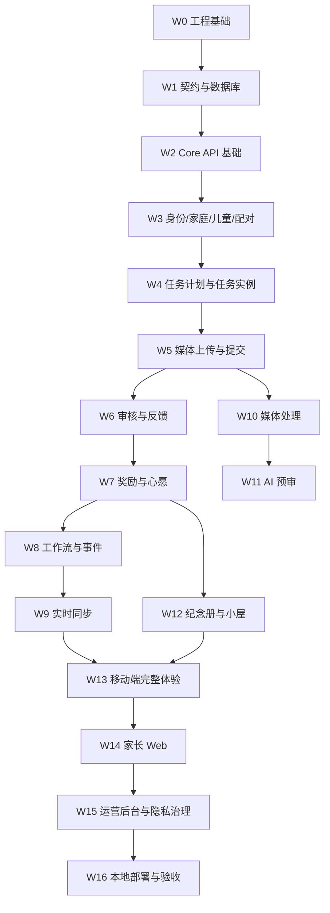

# WishPool 实现计划

版本：v1.0  
日期：2026-08-12

## 1. 计划原则

这份计划是完整产品的实现顺序，不是缩减范围，也不是临时版本。拆分依据是工程依赖和风险控制：

- 先建立契约、数据库、基础设施和工程规范。
- 再实现事实源和状态机，确保核心数据不会乱。
- 再实现媒体、AI、实时、通知等异步能力。
- 最后实现多端体验、后台治理和体验打磨。

每个工作包都应具备：

- 明确依赖。
- 明确产出物。
- 明确验收标准。
- 可自动化验证的测试。
- 对应文档同步。

## 2. 工作流总览



## 3. 依赖分层

| 层 | 目标 | 包含 |
| --- | --- | --- |
| 基础层 | 让工程可启动、可迁移、可测试 | monorepo、CI、Docker Compose、OpenAPI、Flyway |
| 事实层 | 建立可信业务事实源 | core-api、PostgreSQL、权限、状态机、outbox |
| 协作层 | 让家庭多设备协作成立 | 提交、审核、奖励、心愿、实时、通知 |
| 智能层 | 让 AI 和媒体处理进入审核链路 | media-worker、ai-gateway、ai-worker、Temporal |
| 体验层 | 让儿童和家长自然使用 | Flutter App、家长 Web、视觉系统、纪念册、小屋 |
| 治理层 | 让系统可长期自用和维护 | Admin、审计、隐私删除、导出、观测 |

## 4. 工作包详情

### W0 工程基础

目标：让仓库具备多语言工程协作的基本形态。

依赖：无。

产出：

- 根目录构建约定。
- `.editorconfig`。
- Git ignore。
- 基础 README。
- CI 骨架。
- 目录骨架：`apps/`、`services/`、`packages/`、`db/`、`infra/`。

验收：

- 新开发者能根据 README 启动本地依赖。
- CI 能执行基础 lint/format/check 占位任务。
- 项目结构文档更新。

### W1 契约与数据库

目标：固化 API 和数据库事实模型。

依赖：W0。

已有资产：

- `packages/api-contracts/openapi/wishpool.yaml`
- `db/migrations/V001__initial_schema.sql`

产出：

- OpenAPI lint。
- API 生成配置：Kotlin server stubs、Dart client、TypeScript client。
- Flyway 配置。
- 数据库迁移验证。
- 本地 seed 设计。

验收：

- OpenAPI 可通过 lint。
- 生成客户端不报错。
- Flyway 能在空 PostgreSQL 上成功应用。
- 核心表、约束、索引与详细设计一致。

### W2 Core API 基础

目标：建立 Kotlin/Spring Boot 核心服务骨架。

依赖：W1。

产出：

- `services/core-api`。
- Spring Boot + Kotlin + Gradle Kotlin DSL。
- jOOQ 或数据库访问配置。
- Flyway 启动集成。
- Problem Details 错误格式。
- `X-Trace-Id` 处理。
- 健康检查。
- OpenAPI server interface 接入。

验收：

- `core-api` 本地可启动。
- 能连接本地 PostgreSQL。
- `/actuator/health` 或等价健康接口可用。
- 错误响应符合 OpenAPI。

### W3 身份、家庭、儿童、配对

目标：建立家庭空间和儿童设备身份。

依赖：W2。

模块：

- Identity。
- Family。
- Child。
- Pairing。

产出：

- 手机号验证码登录接口。自用本地部署可先使用本地 mock 短信 provider，但接口和 provider adapter 必须完整。
- 微信 provider adapter 预留。
- refresh token 会话。
- 创建家庭。
- 创建儿童资料。
- 家庭成员查询。
- 儿童设备配对码创建和消费。
- 权限 policy 基础。
- 审计日志基础。

验收：

- 家长可登录并创建家庭。
- 家长可创建儿童资料。
- 家长可生成配对码。
- 儿童设备可通过配对码获得受限会话。
- 儿童设备不能访问家长 API。
- 相关命令有单元测试和集成测试。

### W4 任务模板、周计划、任务实例

目标：实现“今天该做什么”的事实模型。

依赖：W3。

模块：

- Task Template。
- Weekly Plan。
- Task Instance。

产出：

- 任务模板 CRUD。
- 周计划保存。
- 周计划规则校验。
- 任务实例物化。
- 今日任务查询。
- 家长今日概览。
- 跳过、延后、临时任务。
- `planning.weekly_plan_saved`、`task.created`、`task.updated` 事件。

验收：

- 保存一周计划后能生成对应日期任务。
- 模板修改不影响历史任务实例快照。
- 今日任务按 child/date/sort_order 查询。
- 跳过任务触发 daily summary 重算入口。
- 并发保存计划使用 version 防冲突。

### W5 媒体上传与提交

目标：实现照片、语音、视频提交的可信链路。

依赖：W4。

模块：

- Media。
- Submission。

产出：

- 创建上传会话。
- MinIO 签名 URL。
- finalize media。
- 创建 submission。
- submission_media 关联。
- 重提与 superseded。
- 客户端幂等。
- `submission.created` 事件。

验收：

- 客户端可申请上传 URL 并直传 MinIO。
- finalize 会校验媒体元数据和权限。
- 同一个 `client_mutation_id` 不重复创建 submission。
- `needs_revision` 任务可重提，旧 submission 被替代。
- 儿童设备只能给自己的任务提交。

### W6 家长审核与反馈

目标：实现家长 10-30 秒审核链路的后端事实。

依赖：W5。

模块：

- Review。
- Feedback。

产出：

- 待审核列表。
- 审核详情。
- 通过审核。
- 退回修改。
- 文字/表情/语音反馈。
- 撤销审核。
- `review.approved`、`review.revision_requested`、`feedback.created` 事件。

验收：

- 同一 submission 只能有一个未撤销审核。
- 并发审核只有一个成功。
- 通过后 task/submission 状态一致。
- 退回后儿童可重新提交。
- 反馈能被儿童端查询和实时事件引用。

### W7 奖励与心愿

目标：实现星光、心愿碎片、心愿卡和核销事实。

依赖：W6。

模块：

- Reward。
- Wish。
- Daily Summary。

产出：

- 星光账本。
- 心愿碎片账本。
- daily summary 聚合。
- 心愿创建、激活、进度、解锁。
- 心愿核销。
- 奖励修正。
- 幂等键约束。
- `reward.star_light_granted`、`reward.wish_fragment_granted`、`wish.unlocked`、`wish.redeemed` 事件。

验收：

- 任务通过发星光。
- 当天核心任务全部 approved/skipped 只发 1 块碎片。
- 重复事件不会重复发奖励。
- 碎片达标自动解锁心愿。
- 撤销审核写 adjustment，不物理删除历史奖励，并同步修正 `daily_summary` 和心愿碎片进度。

### W8 工作流与 Outbox

目标：把跨模块长流程从同步 API 中剥离。

依赖：W4-W7。

模块：

- Workflow Worker。
- Transactional Outbox。
- Family Event。

产出：

- outbox publisher。
- family_event seq 生成。
- `MaterializeWeeklyPlanWorkflow`。
- `RewardEvaluationWorkflow`。
- `GenerateMemoryWorkflow` 骨架。
- `PrivacyDeletionWorkflow` 骨架。

验收：

- 业务事务和 outbox 写入同事务。
- outbox publisher 可重试。
- 每个 family 的 event seq 单调递增。
- 工作流失败可重试、可观察。

已落地：

- Core API 写 `family_event` 和 `outbox_event` 同事务。
- `outbox_event` 支持领取租约、发布确认和失败重试。
- `workflow-worker` 使用 Temporal SDK，按 outbox 事件启动计划物化、奖励结算、纪念册和隐私删除工作流。
- `/sync/pull` 已实现游标补拉和儿童设备脱敏占位。
- 真实本地烟测覆盖计划保存 -> 内部物化 -> 同步拉取 -> 跳过任务 -> 奖励 activity -> outbox claim/published。

### W9 实时同步

目标：让多设备按家庭事件同步。

依赖：W8。

模块：

- Realtime Gateway。
- Sync Pull。

产出：

- WebSocket 连接鉴权。
- family channel。
- afterSeq 增量推送。
- `/sync/pull`。
- 断线重连协议。
- Redis 连接索引。

验收：

- 家长审核后儿童设备几秒内收到事件。
- 客户端 seq 不连续时能补拉。
- 儿童设备只收到自己有权访问的数据。
- WebSocket 断开不影响事实状态。

实现记录：

- `services/realtime-gateway` 已初始化为 Kotlin/Ktor 服务。
- `/realtime` 提供 WebSocket 连接，`/realtime/sse` 提供 SSE 替代通道。
- 连接使用用户 Bearer token 调 Core API `/me` 完成家庭成员校验。
- 事件推送通过 Core API `/sync/pull` 读取，复用家长与儿童设备权限过滤、`sync.redacted` 占位和 `afterSeq` 游标语义。
- Redis 记录家庭连接集合和连接元数据，连接活跃时续期，断开时清理。
- WebSocket 支持客户端 `ping` 和 `sync.pull` 消息，服务端按连接发送 `realtime.connected`、`family.event`、`realtime.heartbeat`、`realtime.pong` 和 `realtime.error`。

### W10 媒体处理

目标：让原始媒体形成可审核、可 AI 处理、可纪念册使用的衍生资源。

依赖：W5、W8。

模块：

- Media Worker。

产出：

- 图片缩略图、中图、EXIF 清理。
- 音频标准化、波形 JSON。
- 视频封面、预览和关键帧。
- media_derivative 写入。
- 媒体失败重试。

验收：

- 图片提交能生成审核缩略图。
- 音频提交能生成波形和标准格式。
- 视频提交能生成封面和预览。
- 衍生文件路径和权限符合媒体设计。

实现记录：

- Core API 已为 `media_asset` 增加处理租约、可重试时间、尝试次数和错误字段。
- `/media/{mediaId}/finalize` 成功后写 `media.uploaded` family event 与 outbox event。
- Core API 内部媒体接口已支持处理任务领取、处理源读取、处理开始、处理完成和处理失败。
- `workflow-worker` 已把 `media.uploaded` 路由到 `MediaProcessingWorkflow`，并通过 activity 将媒体标记为 `processing`。
- `services/media-worker` 已初始化为 Python worker，使用 S3-compatible storage、Pillow 和 FFmpeg 生成图片/音频/视频衍生文件并写回 `media_derivative`。
- 图片链路真实烟测已覆盖：上传 JPEG -> finalize -> media-worker 领取 -> 生成 `thumbnail`、`preview`、`ai_ready` -> 媒体状态变 `ready` -> 写 `media.processing_completed`。

### W11 AI 预审

目标：让 AI 进入审核链路，但不替代家长判断。

依赖：W8、W10。

模块：

- AI Gateway。
- AI Worker。
- AI Precheck。

产出：

- `AIPrecheckWorkflow`。
- AI job 状态机。
- OCR 预审。
- 朗读 ASR/目标文本比对。
- 视频基础预审。
- content safety。
- model invocation log。
- AI 失败兜底。

验收：

- 图片/音频提交能生成结构化 AI 预审。
- AI 结果带 provider/model/version/promptVersion。
- AI 失败时 submission 仍进入待审核。
- 家长端只看到“AI 建议”。

实现记录：

- `services/ai-worker` 已初始化为 Python 标准库 HTTP worker，提供预审、反馈草稿、纪念册文案和隐私摘要能力边界。
- Core API 已增加 `ai_job` 和 `ai_precheck` 写入链路，`submission.created` 事件会经 workflow-worker 触发 AI 预审。
- AI worker 未配置时 Core API 使用确定性本地兜底，保证提交仍然进入家长审核。
- 提交详情已返回 `aiPrecheck` 字段，供客户端展示“AI 建议”。

### W12 成长纪念册与小屋

目标：让完成记录沉淀，并回流到儿童小屋。

依赖：W7、W10、W11。

模块：

- Memory。
- Room。

产出：

- 周成长卡生成。
- memory_item 聚合。
- 家长精选。
- 纪念册时间轴。
- 小屋状态查询。
- 小屋元素解锁。
- PDF/长图导出任务。

验收：

- 心愿核销后生成周成长卡。
- 周卡包含心愿、任务统计、照片、声音、父母留言。
- 精选照片能进入小屋照片墙。
- 阅读/家务/运动等里程碑能解锁小屋元素。

实现记录：

- Core API 已实现 `/memories`、`/memories/{memoryId}` 和 `/memories/{memoryId}/export`。
- `wish.redeemed` 事件会经 workflow-worker 调用 Core API 生成或更新周成长卡，聚合已通过审核任务作为 memory item。
- 纪念册生成会解锁小屋展示物并发布 `memory.generated`、`room.item_unlocked`。
- Core API 已实现 `/room/state` 和 `/room/items/{itemId}/arrange`，支持小屋读取和摆放。

### W13 移动端完整体验

目标：实现儿童和家长移动端的完整交互。

依赖：W3-W12。

模块：

- Flutter App。
- 本地 SQLite。
- OpenAPI Dart client。
- WebSocket sync。
- 相机/录音/视频/上传。

产出：

- 家长登录。
- 儿童配对。
- 儿童小屋、今天、心愿、回忆。
- 图片/语音/视频提交。
- 家长首页、待审核、审核详情、反馈。
- 周计划、心愿创建、核销。
- 本地缓存、上传队列、断网恢复。

验收：

- 儿童能独立完成任务提交。
- 家长能完成审核和反馈。
- 前台实时反馈可达。
- 断网提交草稿可恢复。
- 关键页面符合视觉方向文档。

实现记录：

- `apps/mobile` 已初始化 Flutter 工程结构。
- 已建立儿童首页、今日任务、心愿、小屋和家长审核入口页面。
- 已建立跨端主题和样例数据映射，后续 API client 接入时保持页面结构不变。
- 本机未安装 Flutter SDK 时，仓库检查会执行源码结构校验；安装 SDK 后同一脚本会运行 Flutter 测试。

### W14 家长 Web

目标：实现家长的高效率桌面操作。

依赖：W3-W12。

模块：

- Parent Web。
- TypeScript OpenAPI client。

产出：

- 登录。
- 家庭/儿童切换。
- 周计划批量编辑。
- 任务模板管理。
- 审核辅助视图。
- 纪念册时间轴、精选、导出。
- 家庭成员和隐私设置。

验收：

- 家长可以在 Web 上配置一周计划。
- 长历史回忆可检索和查看。
- 纪念册可导出。
- Web 与移动端共享同一事实状态。

实现记录：

- `apps/parent-web` 已初始化 Next.js/TypeScript 工程结构。
- 已建立家长工作台、待审核、计划、心愿、纪念册、小屋和本地服务状态视图。
- Web 端共享 `packages/design-tokens` 和 `packages/app-fixtures`，与移动端保持视觉和数据语义一致。

### W15 运营后台、审计、隐私治理

目标：让系统可长期维护。

依赖：W3-W12。

模块：

- Admin Web。
- Admin API。
- Audit。
- Privacy。

产出：

- 管理员登录和 RBAC。
- 元数据检索。
- 工单式媒体访问授权。
- 审计日志查询。
- 数据导出。
- 家庭删除工作流。
- AI 质量和成本看板。

验收：

- 运营默认不能查看儿童原始媒体。
- 敏感操作都有 audit_log。
- 家庭删除覆盖数据库、对象存储、AI 衍生数据。
- 导出文件短期有效并可清理。

实现记录：

- `apps/admin-web` 已初始化 Next.js/TypeScript 本地治理后台。
- 已建立服务健康、异步队列、隐私请求、存储、工作流和审计视图。
- Core API 已实现 `/privacy/export` 和 `/privacy/delete`，并通过 workflow-worker 执行家庭删除状态机。
- 隐私删除会锁定家庭、标记儿童和成员记录、标记媒体删除、写 audit log，并发布完成事件。
- `services/admin-api` 已初始化为 Kotlin/Ktor 本地治理 API，代理 Core API 内部仪表盘、家庭元数据、隐私请求、审计日志和受控媒体访问接口。
- Core API 已实现内部后台路由，并对媒体访问授权写审计日志。

### W16 本地部署、观测与验收

目标：让自用本地部署稳定运行。

依赖：W0-W15。

产出：

- 本地部署文档。
- 服务健康检查。
- 日志和 traceId。
- Prometheus/Grafana 或轻量替代。
- 备份恢复脚本。
- 数据库迁移流程。
- 端到端验收清单。

验收：

- 一条命令启动依赖。
- 服务可重启，数据不丢。
- 关键链路有日志和 trace。
- PostgreSQL 和对象存储有备份策略。

实现记录：

- Docker Compose 已纳入 PostgreSQL、Redis、MinIO、Temporal、Core API、Realtime Gateway、Workflow Worker、AI Worker、Media Worker、Notification Service 和 Admin API。
- 根目录 `npm run check` 已覆盖 OpenAPI、Flyway 命名、Compose config、Core API、Workflow Worker、Realtime Gateway、Media Worker、AI Worker、Notification Service、Admin API、共享包和客户端结构检查。
- `services/notification-service` 已初始化为 Kotlin/Ktor 调度服务，负责领取 Core API 通知事件并按偏好/通道规则回写调度结果。
- Core API 已实现通知 inbox、已读、偏好、push token 和内部通知调度接口；领域事件会投影为通知事实。

## 5. 横向任务

这些任务不独立排在最后，而是随每个工作包持续完成。

| 横向任务 | 要求 |
| --- | --- |
| 文档同步 | 每个模块创建或修改后更新 `MODULE.md` 和项目结构索引 |
| 契约同步 | API 先改 OpenAPI，再改实现和客户端 |
| 数据迁移 | 只追加 Flyway migration，不改已应用 migration |
| 权限测试 | 每个 command 都要有正向和越权测试 |
| 审计 | 敏感操作上线时必须写 audit_log |
| 观测 | 每个服务带 traceId、结构化日志和健康检查 |
| 本地部署 | 新服务要加入本地运行说明 |
| 视觉一致性 | UI 实现对照 `VISUAL_DESIGN_DIRECTION.md` |

## 6. 推荐执行顺序

建议每次只开一个主工作包，并把可并行的工作拆到子任务：

1. W0 工程基础。
2. W1 契约与数据库验证。
3. W2 Core API 基础。
4. W3 身份、家庭、儿童、配对。
5. W4 任务计划与任务实例。
6. W5 媒体上传与提交。
7. W6 家长审核与反馈。
8. W7 奖励与心愿。
9. W8 工作流与 Outbox。
10. W9 实时同步。
11. W10 媒体处理。
12. W11 AI 预审。
13. W12 纪念册与小屋。
14. W13 移动端完整体验。
15. W14 家长 Web。
16. W15 运营后台与隐私治理。
17. W16 本地部署、观测与验收。

其中 W13 可以在 W3 后开始搭 UI 壳和设计系统，但所有关键交互必须最终接入真实 API、同步事件和本地缓存，不能停留在 mock。

## 7. 里程碑验收链路

完整产品的核心验收链路：

```text
家长手机号登录
  -> 创建家庭和儿童资料
  -> 儿童设备配对
  -> 家长配置周计划和心愿
  -> 任务实例生成
  -> 儿童提交照片/语音/视频
  -> 媒体处理
  -> AI 预审
  -> 家长审核并反馈
  -> 奖励账本写入
  -> 心愿碎片和心愿解锁
  -> 心愿核销
  -> 周成长卡生成
  -> 小屋元素解锁
  -> 多端实时同步
  -> 审计、导出、删除可验证
```

只有这条链路的事实、媒体、AI、同步、权限和治理都完整，才算实现完成。
